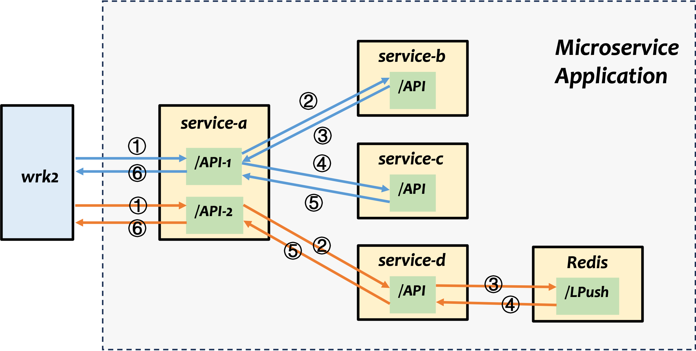

# Go HTTP Service Demo

This application is a simple microservice application with two API endpoints and five components, demonstrating request propagation, header passing, and downstream service calls. It is designed for distributed tracing testing. The architecture of the application is shown in the figure below.



## API Endpoints

### /API1

- Receives a request with a `Request-ID` header.
- Calls **service-b** and waits for its response.
- Then calls **service-c** with the same `Request-ID` and waits for its response.
- Returns a response to the client, including the `Request-ID` and both downstream responses.

### /API2

- Receives a request with a `Request-ID` header.
- Calls **service-d** with the same `Request-ID`. In the downstream chain, **service-d** extracts the `Request-ID` and inserts it into **Redis**.
- **service-a** waits for response from **service-d** and then returns a response to the client, including the `Request-ID` and the downstream response.


## How to Start

### Build and Start All Services with Docker Compose

Make sure you have **Docker** and **Docker Compose** installed.

```bash
docker-compose up --build
```

This will start:

- Main HTTP server
- `service-b`
- `service-c`
- `service-d`
- Redis

### Check Running Containers

```bash
docker-compose ps
```

## How to Stop

To stop all services, run:

```bash
docker-compose down
```

## How to Send Requests

You can use container `wrk2` to send requests with a custom `Request-ID` header.

### Example:

```bash
sudo docker exec -it client ./client
```

A Lua script is provided for `wrk2` to:


- Each request randomly selects `/api1` or `/api2`
- Each request generates a unique 64-bit numeric `Request-ID`
- The `Request-ID` is propagated through all downstream services and included in all responses


