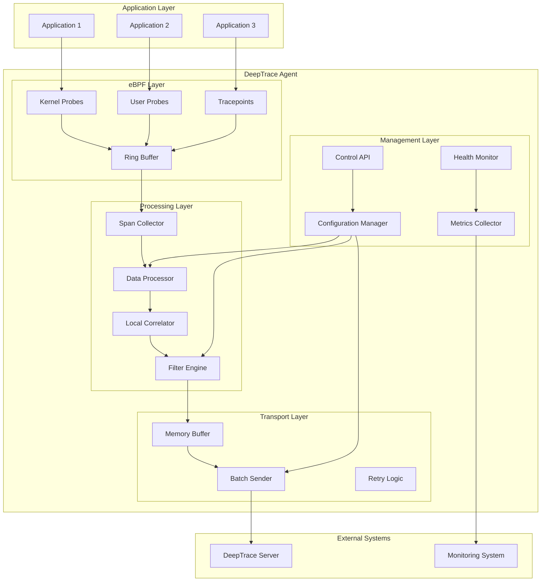

# Agent Architecture

The DeepTrace Agent is a lightweight, high-performance component responsible for collecting distributed tracing data from applications without requiring code modifications. This document provides a detailed overview of the agent's architecture, components, and operational principles.

## Overview

The DeepTrace Agent operates as a system-level service that uses eBPF (Extended Berkeley Packet Filter) technology to transparently capture network communications and system calls. It processes this raw data into structured spans and transmits them to the DeepTrace Server for correlation and analysis.

## Architecture Diagram



## Core Components

### 1. eBPF Layer

The eBPF layer provides the foundation for non-intrusive data collection:

#### Kernel Probes (kprobes)
- **Purpose**: Intercept kernel function calls
- **Target Functions**: `tcp_sendmsg`, `tcp_recvmsg`, `tcp_connect`, `tcp_close`
- **Data Captured**: Network I/O operations, connection lifecycle events
- **Performance Impact**: Minimal overhead (~1-3% CPU)

#### User Probes (uprobes)
- **Purpose**: Intercept user-space function calls
- **Target Functions**: SSL/TLS library functions, HTTP parsers
- **Data Captured**: Encrypted traffic metadata, application-level protocols
- **Dynamic Attachment**: Automatically detects and attaches to relevant processes

#### Tracepoints
- **Purpose**: Leverage kernel's built-in instrumentation points
- **Target Events**: Socket creation/destruction, process lifecycle
- **Data Captured**: System-level events and metadata
- **Stability**: More stable than kprobes across kernel versions

#### Ring Buffer
- **Purpose**: Efficient data transfer from kernel to user space
- **Size**: Configurable (default: 256KB per CPU)
- **Performance**: Lock-free, high-throughput data structure
- **Overflow Handling**: Configurable drop or block behavior

### 2. Processing Layer

The processing layer transforms raw eBPF events into structured spans:

#### Span Collector
```rust
pub struct SpanCollector {
    ring_buffer: RingBuffer,
    event_handlers: HashMap<EventType, Box<dyn EventHandler>>,
    span_builder: SpanBuilder,
}

impl SpanCollector {
    pub fn collect_events(&mut self) -> Result<Vec<RawEvent>, CollectionError> {
        let mut events = Vec::new();
        
        while let Some(event) = self.ring_buffer.poll()? {
            if let Some(handler) = self.event_handlers.get(&event.event_type) {
                if let Some(processed_event) = handler.process(event)? {
                    events.push(processed_event);
                }
            }
        }
        
        Ok(events)
    }
}
```

#### Data Processor
- **Protocol Detection**: Automatically identifies HTTP, gRPC, MySQL, Redis protocols
- **Payload Extraction**: Captures request/response payloads with size limits
- **Metadata Enrichment**: Adds process information, timestamps, and context
- **Data Sanitization**: Removes sensitive information based on configuration

#### Local Correlator
- **Request/Response Matching**: Correlates outgoing requests with incoming responses
- **Connection Tracking**: Maintains connection state across multiple spans
- **Temporal Ordering**: Ensures proper span timing and relationships
- **Memory Management**: Efficient cleanup of completed correlations

#### Filter Engine
```rust
pub struct FilterEngine {
    process_filters: Vec<ProcessFilter>,
    protocol_filters: Vec<ProtocolFilter>,
    content_filters: Vec<ContentFilter>,
}

impl FilterEngine {
    pub fn should_capture(&self, span: &Span) -> bool {
        self.process_filters.iter().all(|f| f.matches(span)) &&
        self.protocol_filters.iter().any(|f| f.matches(span)) &&
        self.content_filters.iter().all(|f| f.allows(span))
    }
}
```

### 3. Transport Layer

The transport layer handles reliable delivery of spans to the server:

#### Memory Buffer
- **Structure**: Circular buffer with configurable size
- **Persistence**: Optional disk-based overflow buffer
- **Compression**: Configurable compression algorithms (gzip, lz4)
- **Batching**: Automatic batching based on size and time thresholds

#### Batch Sender
```rust
pub struct BatchSender {
    client: HttpClient,
    buffer: VecDeque<Span>,
    config: SenderConfig,
    retry_queue: RetryQueue,
}

impl BatchSender {
    pub async fn send_batch(&mut self) -> Result<(), SendError> {
        if self.buffer.len() >= self.config.batch_size || 
           self.last_send.elapsed() >= self.config.batch_timeout {
            
            let batch = self.create_batch();
            match self.client.send(batch).await {
                Ok(_) => self.buffer.clear(),
                Err(e) => self.retry_queue.push(batch, e),
            }
        }
        
        Ok(())
    }
}
```

#### Retry Logic
- **Exponential Backoff**: Configurable retry intervals with jitter
- **Circuit Breaker**: Prevents overwhelming failed servers
- **Dead Letter Queue**: Persistent storage for failed batches
- **Health-based Routing**: Automatic failover to backup servers

### 4. Management Layer

The management layer provides operational capabilities:

#### Configuration Manager
- **Hot Reload**: Dynamic configuration updates without restart
- **Validation**: Schema validation and dependency checking
- **Environment Override**: Environment variable support
- **Default Fallback**: Sensible defaults for all configuration options

#### Health Monitor
```rust
pub struct HealthMonitor {
    components: HashMap<String, Box<dyn HealthCheck>>,
    status: Arc<RwLock<HealthStatus>>,
}

impl HealthMonitor {
    pub async fn check_health(&self) -> HealthStatus {
        let mut overall_status = HealthStatus::Healthy;
        let mut component_statuses = HashMap::new();
        
        for (name, checker) in &self.components {
            let status = checker.check().await;
            component_statuses.insert(name.clone(), status.clone());
            
            if status.is_unhealthy() {
                overall_status = HealthStatus::Unhealthy;
            }
        }
        
        HealthStatus {
            overall: overall_status,
            components: component_statuses,
            timestamp: Utc::now(),
        }
    }
}
```

#### Metrics Collector
- **Performance Metrics**: CPU usage, memory consumption, network I/O
- **Business Metrics**: Spans collected, correlation rate, error rate
- **eBPF Metrics**: Program load status, map utilization, event rates
- **Export Formats**: Prometheus, StatsD, JSON

## Data Flow

### 1. Event Capture
```
Application → System Call → eBPF Program → Ring Buffer → User Space
```

### 2. Span Construction
```
Raw Event → Protocol Detection → Payload Extraction → Span Building
```

### 3. Local Processing
```
Span → Filtering → Local Correlation → Enrichment → Buffering
```

### 4. Transmission
```
Buffer → Batching → Compression → HTTP Transport → Server
```

## Performance Characteristics

### Resource Usage

| Component | CPU Impact | Memory Usage | Network Overhead |
|-----------|------------|--------------|------------------|
| eBPF Programs | 1-3% | 10-50MB | None |
| Span Processing | 2-5% | 50-200MB | None |
| Data Transmission | 1-2% | 10-50MB | 1-5% of app traffic |
| **Total** | **4-10%** | **70-300MB** | **1-5%** |

### Scalability Limits

| Metric | Typical | Maximum | Bottleneck |
|--------|---------|---------|------------|
| Spans/second | 10,000 | 100,000 | CPU processing |
| Concurrent connections | 1,000 | 10,000 | Memory usage |
| Payload size | 1KB | 64KB | Network bandwidth |
| Buffer size | 16MB | 1GB | Available memory |

## Security Considerations

### Privilege Requirements
- **CAP_BPF**: Required for eBPF program loading (kernel 5.8+)
- **CAP_SYS_ADMIN**: Required for older kernels
- **Root Access**: Alternative to capabilities (not recommended)

### Data Protection
- **Payload Filtering**: Configurable content-type exclusions
- **Sensitive Data Masking**: Automatic detection and redaction
- **Encryption in Transit**: TLS support for server communication
- **Local Storage**: Optional encryption for disk buffers

### Attack Surface
- **eBPF Verifier**: Kernel-level safety guarantees
- **User Space**: Standard application security practices
- **Network Communication**: Standard HTTPS security
- **Configuration**: File system permissions and validation

## Deployment Patterns

### Sidecar Pattern
```yaml
apiVersion: apps/v1
kind: Deployment
metadata:
  name: app-with-deeptrace
spec:
  template:
    spec:
      containers:
      - name: application
        image: myapp:latest
      - name: deeptrace-agent
        image: deeptrace/agent:latest
        securityContext:
          capabilities:
            add: ["SYS_ADMIN"]
        volumeMounts:
        - name: config
          mountPath: /etc/deeptrace
```

### DaemonSet Pattern
```yaml
apiVersion: apps/v1
kind: DaemonSet
metadata:
  name: deeptrace-agent
spec:
  template:
    spec:
      hostNetwork: true
      hostPID: true
      containers:
      - name: deeptrace-agent
        image: deeptrace/agent:latest
        securityContext:
          privileged: true
```

### Systemd Service
```ini
[Unit]
Description=DeepTrace Agent
After=network.target

[Service]
Type=simple
ExecStart=/usr/bin/deeptrace-agent --config /etc/deeptrace/agent.toml
Restart=always
RestartSec=5
User=root

[Install]
WantedBy=multi-user.target
```

## Troubleshooting

### Common Issues

#### eBPF Program Load Failures
```bash
# Check kernel version
uname -r

# Verify eBPF support
ls /sys/fs/bpf/

# Check loaded programs
sudo bpftool prog list | grep deeptrace

# Debug program loading
sudo dmesg | grep bpf
```

#### High Resource Usage
```bash
# Monitor agent performance
top -p $(pgrep deeptrace-agent)

# Check eBPF map usage
sudo bpftool map show

# Analyze memory allocation
valgrind --tool=massif ./deeptrace-agent
```

#### Missing Spans
```bash
# Verify process filtering
curl http://localhost:7899/processes

# Check eBPF attachment
sudo bpftool prog show | grep -A5 deeptrace

# Monitor event rates
curl http://localhost:7899/metrics | grep span_rate
```

## Best Practices

### Configuration
1. **Start Conservative**: Begin with default settings and tune gradually
2. **Monitor Impact**: Continuously monitor application performance
3. **Filter Aggressively**: Exclude unnecessary processes and protocols
4. **Batch Efficiently**: Optimize batch sizes for your network conditions

### Operations
1. **Health Monitoring**: Implement comprehensive health checks
2. **Log Analysis**: Monitor agent logs for errors and warnings
3. **Capacity Planning**: Plan for peak traffic scenarios
4. **Graceful Updates**: Use rolling updates to minimize disruption

### Security
1. **Least Privilege**: Use capabilities instead of root when possible
2. **Network Security**: Secure communication channels with TLS
3. **Data Governance**: Implement data retention and privacy policies
4. **Access Control**: Restrict access to agent configuration and APIs
