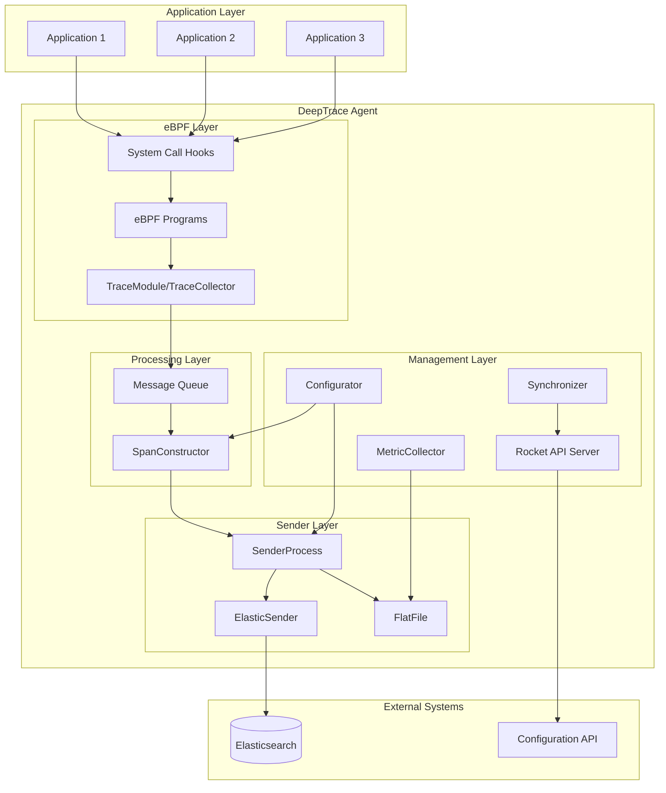

# Agent Architecture

The DeepTrace Agent is a lightweight, high-performance Rust-based component responsible for collecting distributed tracing data from applications without requiring code modifications. This document provides a detailed overview of the agent's architecture, components, and operational principles based on the actual implementation.

## Overview

The DeepTrace Agent operates as a system-level service that uses eBPF (Extended Berkeley Packet Filter) technology to transparently capture network communications and system calls. It processes this raw data into structured spans and transmits them directly to Elasticsearch for storage and later processing by the DeepTrace Server.

## Architecture Diagram



## Core Components

### 1. eBPF Layer

The eBPF layer provides the foundation for non-intrusive data collection:

#### TraceModule/TraceCollector
- **Purpose**: Main eBPF program management and data collection
- **Implementation**: Rust-based eBPF program loader and manager
- **Target Processes**: Configurable via PIDs in configuration
- **Data Collection**: Network system calls and socket operations

#### System Call Hooks
- **Monitored Calls**: 
  - **Read Operations**: `sys_enter_read`, `sys_exit_read`, `sys_enter_readv`, `sys_exit_readv`
  - **Receive Operations**: `sys_enter_recvfrom`, `sys_exit_recvfrom`, `sys_enter_recvmsg`, `sys_exit_recvmsg`, `sys_enter_recvmmsg`, `sys_exit_recvmmsg`
  - **Write Operations**: `sys_enter_write`, `sys_exit_write`, `sys_enter_writev`, `sys_exit_writev`
  - **Send Operations**: `sys_enter_sendto`, `sys_exit_sendto`, `sys_enter_sendmsg`, `sys_exit_sendmsg`, `sys_enter_sendmmsg`, `sys_exit_sendmmsg`
  - **Socket Operations**: `sys_exit_socket`, `sys_enter_close`
- **Configuration**: Enabled probes are configurable via `enabled_probes` array
- **Logging**: Configurable log levels (0=off, 1=debug, 3=verbose, 4=stats)

#### eBPF Configuration
- **Buffer Management**: `max_buffered_events` (default: 128)
- **Process Filtering**: Target specific PIDs for monitoring
- **Probe Selection**: Granular control over which system calls to monitor

### 2. Processing Layer

The processing layer transforms raw eBPF events into structured spans:

#### SpanConstructor
- **Purpose**: Converts raw eBPF messages into structured spans
- **Input**: Receives messages from TraceModule via crossbeam channels
- **Output**: Sends constructed spans to SenderProcess
- **Implementation**: Rust-based message processing with configurable buffering
- **Configuration**: 
  - `cleanup_interval`: Span cleanup timing (default: 30 seconds)
  - `max_sockets`: Maximum tracked sockets (default: 1024)

#### Message Queue System
- **Channel Type**: Crossbeam unbounded/bounded channels
- **Message Flow**: `TraceModule → SpanConstructor → SenderProcess`
- **Buffer Sizes**: Configurable bounded channels (default: 1024)
- **Backpressure**: Automatic handling via channel capacity

#### Data Processing Features
- **Socket Tracking**: Maintains socket state across system calls
- **Request/Response Correlation**: Matches network I/O operations
- **Span Correlation**: Correlates related spans using transaction semantics
- **Metadata Extraction**: Process IDs, timestamps, connection details
- **Span Lifecycle Management**: Automatic cleanup of completed spans

### 3. Sender Layer

The sender layer handles data output to various destinations:

#### SenderProcess
- **Purpose**: Generic sender framework for different output types
- **Implementation**: Configurable sender that can use different backends
- **Channel Integration**: Receives spans from SpanConstructor via channels
- **Supported Backends**: Elasticsearch and File output

#### ElasticSender
- **Purpose**: Direct Elasticsearch integration for span storage
- **Configuration**:
  - `node_url`: Elasticsearch endpoint (e.g., "http://localhost:9200")
  - `username/password`: Authentication credentials
  - `index_name`: Target index for spans
  - `bulk_size`: Batch size for bulk operations (default: 64)
  - `request_timeout`: HTTP timeout (default: 10 seconds)
- **Features**: Bulk indexing, connection management, error handling

#### FlatFile Sender
- **Purpose**: File-based output for debugging and backup
- **Configuration**:
  - `path`: Output file path
  - `rotate`: Enable log rotation
  - `max_size`: Maximum file size before rotation (MB)
  - `max_age`: Retention period (days)
  - `rotate_time`: Rotation interval (days)
  - `data_format`: Date format for file naming
- **Features**: Automatic rotation, compression, structured output

### 4. Management Layer

The management layer provides operational capabilities:

#### Configurator
- **Purpose**: Dynamic configuration management with file watching
- **Features**:
  - File system watching for configuration changes
  - Automatic reload on configuration file modifications
  - Retry logic for handling file write delays
  - Configuration validation and error handling
- **Implementation**: Uses `notify` crate for file system events
- **Configuration Path**: Configurable via command line (`-c` flag)

#### Synchronizer
- **Purpose**: Agent state synchronization and API management
- **Features**: Rocket-based HTTP API server for configuration updates
- **API Endpoints**: `/api/config/update` for dynamic configuration
- **Configuration**: 
  - `address`: API server bind address
  - `port`: API server port
  - `workers`: Number of worker threads
  - `ident`: Server identification string

#### MetricCollector
- **Purpose**: System and application metrics collection
- **Configuration**:
  - `interval`: Collection interval in seconds
  - `sender`: Target sender for metrics (references sender configuration)
- **Output**: Sends metrics to configured sender (typically file-based)
- **Metrics**: CPU usage, memory usage, span counts, system statistics

## Data Flow

### 1. Event Capture
```
Application → System Call → eBPF Hook → TraceModule → Message Channel
```

### 2. Span Construction
```
Message Channel → SpanConstructor → Span Building → Span Channel
```

### 3. Data Output
```
Span Channel → SenderProcess → ElasticSender → Elasticsearch
                            → FlatFile → Local Files
```

### 4. Configuration Management
```
Config File → Configurator → Dynamic Reload → Component Updates
```

## Configuration Structure

The agent uses a TOML-based configuration system with the following structure:

### Core Configuration Sections

#### Agent Configuration
```toml
[agent]
name = "deeptrace"  # Agent identifier
```

#### eBPF Configuration
```toml
[ebpf.trace]
log_level = 1  # 0=off, 1=debug, 3=verbose, 4=stats
pids = [523094]  # Target process IDs
max_buffered_events = 128
enabled_probes = [
    "sys_enter_read", "sys_exit_read",
    "sys_enter_write", "sys_exit_write",
    # ... additional system call hooks
]
```

#### Trace Configuration
```toml
[trace]
ebpf = "trace"  # References ebpf configuration
sender = "trace"  # References sender configuration

[trace.span]
cleanup_interval = 30  # Span cleanup interval (seconds)
max_sockets = 1024     # Maximum tracked sockets
```

#### Sender Configuration
```toml
# Elasticsearch sender
[sender.elastic.trace]
node_url = "http://localhost:9200"
username = "elastic"
password = "***"
request_timeout = 10
index_name = "agent1"
bulk_size = 64

# File sender
[sender.file.metric]
path = "metrics.csv"
rotate = true
max_size = 512  # MB
max_age = 6     # days
rotate_time = 11  # days
data_format = "%Y%m%d"
```

#### Metrics Configuration
```toml
[metric]
interval = 10    # Collection interval (seconds)
sender = "metric" # References sender configuration
```

## Security Considerations

### Privilege Requirements
- **CAP_BPF**: Required for eBPF program loading (kernel 5.8+)
- **CAP_SYS_ADMIN**: Required for older kernels
- **Root Access**: Alternative to capabilities (not recommended)

### Data Protection
- **Payload Filtering**: Configurable content-type exclusions
- **Sensitive Data Masking**: Automatic detection and redaction
- **Encryption in Transit**: TLS support for server communication
- **Local Storage**: Optional encryption for disk buffers

### Attack Surface
- **eBPF Verifier**: Kernel-level safety guarantees
- **User Space**: Standard application security practices
- **Network Communication**: Standard HTTPS security
- **Configuration**: File system permissions and validation

## Deployment and Usage

### Command Line Usage
```bash
# Basic usage with default configuration
cargo run --release

# Specify custom configuration file
cargo run --release -- -c /path/to/config.toml

# With sudo privileges (required for eBPF)
sudo cargo run --release -- -c config/deeptrace.toml
```

### Configuration File Location
- **Default Path**: `config/deeptrace.toml`
- **Custom Path**: Specified via `-c` command line argument
- **Example Configuration**: `config/deeptrace.toml.example`

### Runtime Requirements
- **Privileges**: Root or CAP_BPF capability for eBPF program loading
- **Kernel Version**: Linux kernel with eBPF support
- **Dependencies**: Rust runtime, libbpf, Elasticsearch (for data storage)

### Process Management
- **Startup**: Agent initializes all modules sequentially
- **Shutdown**: Graceful shutdown on SIGINT (Ctrl+C)
- **State Management**: Atomic state management for clean shutdown
- **Error Handling**: Comprehensive error handling with logging

## API Endpoints

The agent provides a REST API for configuration management:

### Configuration Update
```http
POST /api/config/update
Content-Type: application/json

{
  "agent": {
    "name": "deeptrace",
    "workers": 4
  },
  "sender": {
    "elastic": {
      "node_url": "http://localhost:9200",
      "username": "elastic",
      "password": "password",
      "index_name": "spans",
      "bulk_size": 64
    }
  },
  "trace": {
    "pids": [1234, 5678]
  }
}
```

### API Configuration
```toml
# API server settings (part of synchronizer)
address = "0.0.0.0"  # Bind address
port = 8080          # API port
workers = 1          # Worker threads
ident = "deeptrace"  # Server identification
```

## Module Architecture

The agent follows a modular architecture with the following key modules:

### Core Modules
1. **TraceModule/TraceCollector**: eBPF program management and data collection
2. **SpanConstructor**: Raw event processing and span construction
3. **SenderProcess**: Data output management with pluggable backends
4. **MetricCollector**: System metrics collection and reporting
5. **Configurator**: Dynamic configuration management
6. **Synchronizer**: API server and state synchronization

### Module Lifecycle
- **Initialization**: Sequential module startup with dependency management
- **Runtime**: Asynchronous operation with channel-based communication
- **Shutdown**: Graceful shutdown with proper resource cleanup
- **Error Handling**: Per-module error handling with system-wide error propagation

### Inter-Module Communication
- **Channels**: Crossbeam channels for high-performance message passing
- **Configuration**: Shared configuration via Arc<ArcSwap<Config>>
- **State Management**: Atomic state management for coordination
- **Error Propagation**: Structured error handling across module boundaries
