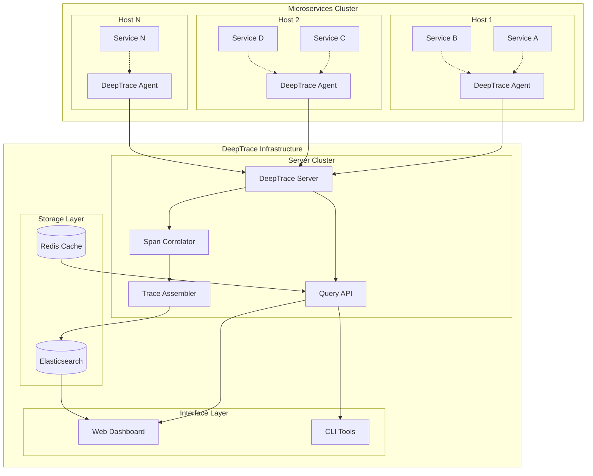
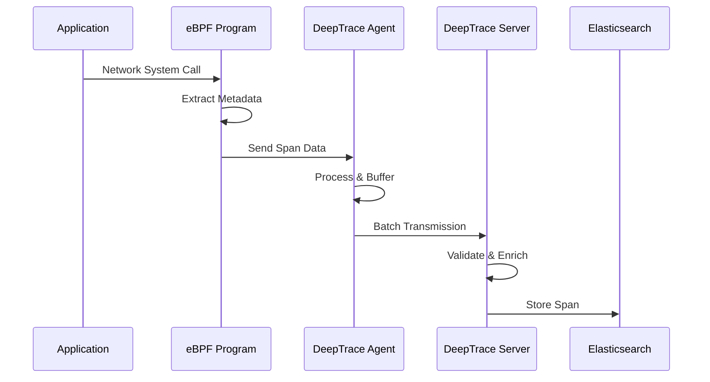
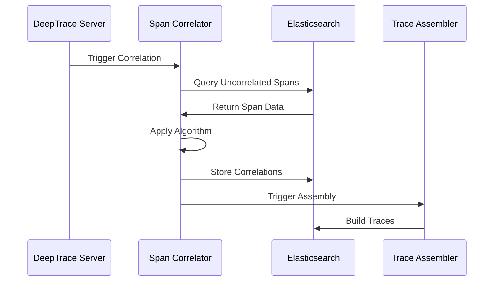
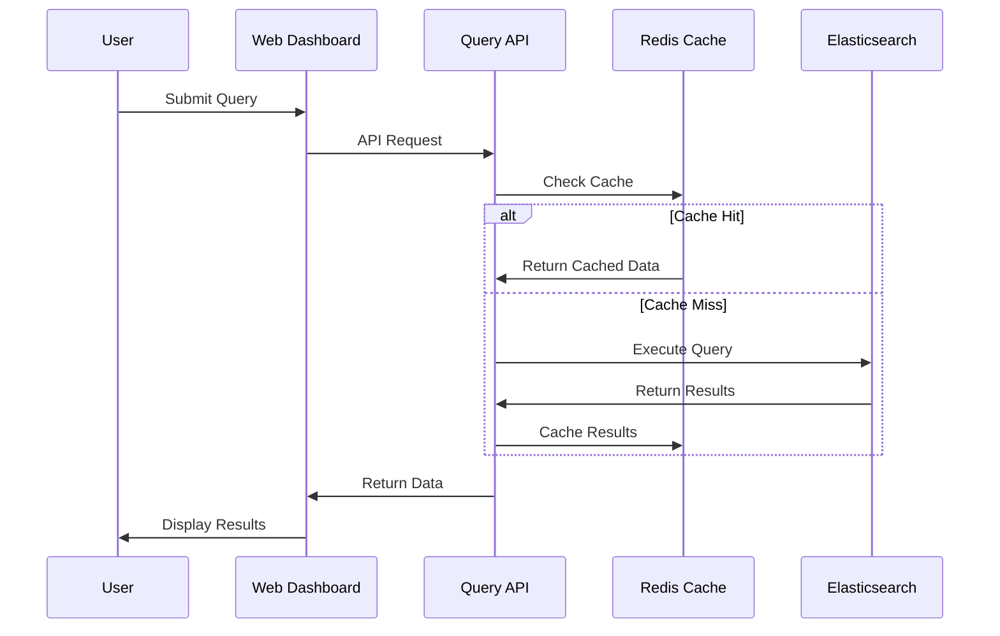
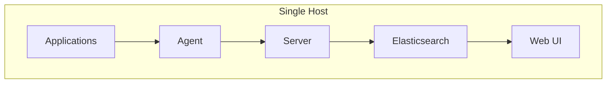
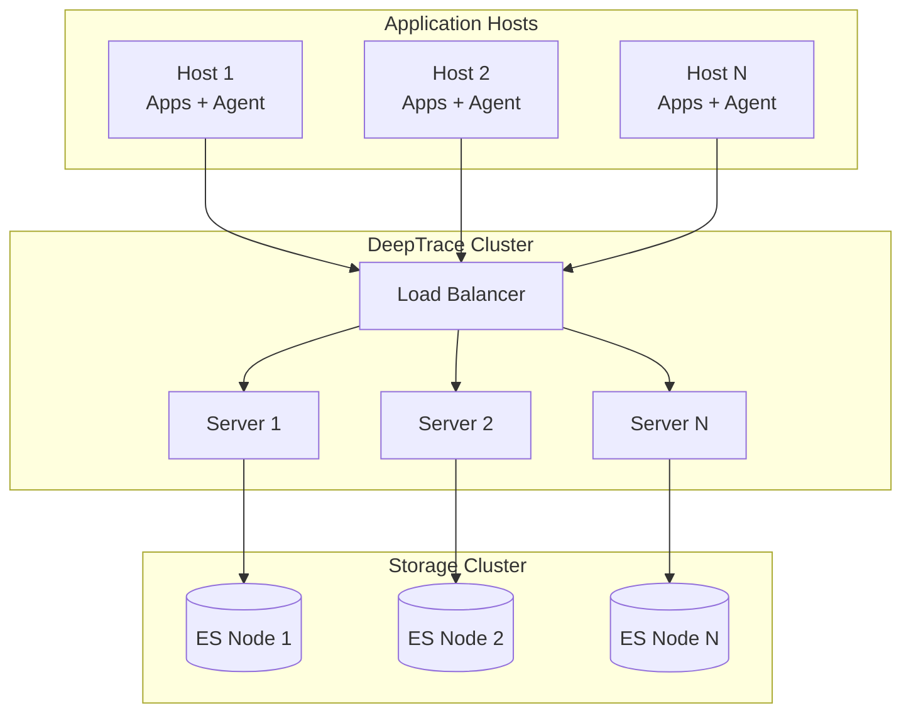
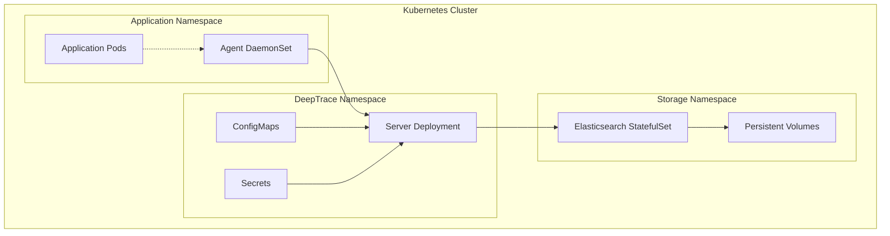

# System Overview

DeepTrace is a sophisticated distributed tracing framework designed for modern microservices architectures. This document provides a comprehensive overview of the system architecture, core components, and design principles.

## Architecture Philosophy

DeepTrace is built on several key architectural principles:

### 1. Non-Intrusive Design
- **Zero Code Changes**: Applications require no modification
- **eBPF-Based**: Leverages kernel-level instrumentation
- **Transparent Operation**: Minimal impact on application behavior

### 2. Scalable Architecture
- **Distributed Components**: Agent-server architecture for scalability
- **Horizontal Scaling**: Components scale independently
- **Efficient Data Flow**: Optimized for high-throughput environments

### 3. Intelligent Correlation
- **Transaction Semantics**: Uses application-level transaction logic
- **Multi-Dimensional Analysis**: Combines temporal and semantic correlation
- **Adaptive Algorithms**: Adjusts to different application patterns

## High-Level Architecture

## Core Components

### 1. DeepTrace Agent

The agent is deployed on each host and is responsible for:

#### Data Collection
- **eBPF Programs**: Kernel-level network monitoring
- **System Call Interception**: Captures network I/O operations
- **Protocol Parsing**: Extracts application-layer information
- **Metadata Extraction**: Collects timing and context information

#### Local Processing
- **Span Construction**: Builds individual request/response spans
- **Data Compression**: Reduces transmission overhead
- **Local Buffering**: Handles temporary network issues
- **Process Filtering**: Monitors only relevant applications

#### Communication
- **Secure Transmission**: Encrypted data transfer to server
- **Batch Processing**: Efficient bulk data transmission
- **Heartbeat Monitoring**: Maintains connection health
- **Configuration Sync**: Receives updates from server

### 2. DeepTrace Server

The server provides centralized processing and management:

#### Span Management
- **Data Ingestion**: Receives spans from multiple agents
- **Validation**: Ensures data integrity and completeness
- **Storage**: Persists spans in Elasticsearch
- **Indexing**: Creates efficient query indexes

#### Correlation Engine
- **Algorithm Selection**: Multiple correlation strategies
- **Transaction Analysis**: Identifies logical request flows
- **Similarity Computation**: Calculates span relationships
- **Confidence Scoring**: Assigns correlation confidence levels

#### Trace Assembly
- **Graph Construction**: Builds trace dependency graphs
- **Path Analysis**: Identifies complete request paths
- **Optimization**: Removes redundant or incorrect correlations
- **Validation**: Ensures trace completeness and accuracy

### 3. Storage Layer

#### Elasticsearch Cluster
- **Primary Storage**: Stores all span and trace data
- **Full-Text Search**: Enables complex queries
- **Time-Series Optimization**: Efficient time-based queries
- **Scalable Storage**: Handles large data volumes

#### Redis Cache
- **Query Acceleration**: Caches frequent queries
- **Session Management**: Handles user sessions
- **Real-Time Data**: Stores live monitoring data
- **Configuration Cache**: Caches system configuration

### 4. Interface Layer

#### Web Dashboard
- **Trace Visualization**: Interactive trace exploration
- **Service Maps**: Dependency visualization
- **Performance Metrics**: Real-time performance monitoring
- **Alert Management**: Configurable alerting system

#### CLI Tools
- **System Management**: Command-line administration
- **Batch Operations**: Bulk data processing
- **Automation**: Scriptable operations
- **Debugging**: Diagnostic and troubleshooting tools

## Data Flow Architecture

### 1. Span Collection Flow

### 2. Correlation Flow

### 3. Query Flow

## Deployment Architectures

### 1. Single Host Deployment

**Use Cases**: Development, testing, small-scale deployments

**Characteristics**:
- Simplified deployment and management
- Lower resource requirements
- Limited scalability
- Suitable for evaluation and development

### 2. Distributed Deployment

**Use Cases**: Production environments, large-scale systems

**Characteristics**:
- High availability and fault tolerance
- Horizontal scalability
- Load distribution
- Production-ready architecture

### 3. Kubernetes Deployment

**Use Cases**: Container orchestration environments

**Characteristics**:
- Native Kubernetes integration
- Automatic scaling and healing
- Resource management
- Service discovery integration

## Scalability Considerations

### 1. Agent Scalability

#### Horizontal Scaling
- **Per-Host Deployment**: One agent per host
- **Process Isolation**: Independent agent processes
- **Resource Limits**: Configurable resource constraints
- **Load Distribution**: Automatic workload balancing

#### Vertical Scaling
- **Multi-Threading**: Parallel span processing
- **Memory Management**: Efficient memory utilization
- **CPU Optimization**: Optimized eBPF programs
- **I/O Efficiency**: Batched network operations

### 2. Server Scalability

#### Horizontal Scaling
- **Stateless Design**: Servers can be added/removed dynamically
- **Load Balancing**: Distribute agent connections
- **Partition Tolerance**: Handle network partitions gracefully
- **Auto-Scaling**: Kubernetes-based automatic scaling

#### Vertical Scaling
- **Parallel Processing**: Multi-threaded correlation algorithms
- **Memory Optimization**: Efficient data structures
- **CPU Utilization**: Optimized algorithms
- **Storage Optimization**: Efficient Elasticsearch usage

### 3. Storage Scalability

#### Data Partitioning
- **Time-Based Sharding**: Partition by time periods
- **Service-Based Sharding**: Partition by service
- **Hash-Based Sharding**: Distribute by hash functions
- **Hybrid Approaches**: Combine multiple strategies

#### Performance Optimization
- **Index Optimization**: Efficient query indexes
- **Compression**: Data compression strategies
- **Caching**: Multi-level caching
- **Archival**: Automated data lifecycle management

## Security Architecture

### 1. Data Protection

#### Encryption
- **In-Transit**: TLS encryption for all communications
- **At-Rest**: Elasticsearch encryption
- **Key Management**: Secure key rotation
- **Certificate Management**: Automated certificate lifecycle

#### Access Control
- **Authentication**: Multi-factor authentication
- **Authorization**: Role-based access control
- **API Security**: Secure API endpoints
- **Audit Logging**: Comprehensive audit trails

### 2. Network Security

#### Network Isolation
- **VPC/VNET**: Private network deployment
- **Firewall Rules**: Restrictive network policies
- **Service Mesh**: Encrypted service communication
- **Network Monitoring**: Traffic analysis and monitoring

#### Endpoint Security
- **Agent Security**: Secure agent deployment
- **Server Hardening**: Security-hardened servers
- **Container Security**: Secure container images
- **Vulnerability Management**: Regular security updates

## Performance Characteristics

### 1. Throughput Metrics

| Component | Metric | Typical Value |
|-----------|--------|---------------|
| **Agent** | Spans/second | 10,000-50,000 |
| **Server** | Ingestion rate | 100,000-500,000 |
| **Correlation** | Spans/minute | 1,000,000+ |
| **Storage** | Write throughput | 10,000-50,000 docs/sec |

### 2. Latency Metrics

| Operation | Typical Latency | Target SLA |
|-----------|----------------|------------|
| **Span Collection** | 0.1-0.5ms | < 1ms |
| **Data Transmission** | 1-5ms | < 10ms |
| **Correlation** | 100-500ms | < 1s |
| **Query Response** | 10-100ms | < 200ms |

### 3. Resource Usage

| Component | CPU Usage | Memory Usage | Network Usage |
|-----------|-----------|--------------|---------------|
| **Agent** | 2-5% | 50-200MB | 1-10MB/s |
| **Server** | 10-30% | 1-4GB | 10-100MB/s |
| **Elasticsearch** | 20-60% | 4-16GB | 5-50MB/s |

---

This architectural overview provides the foundation for understanding DeepTrace's design and implementation. The modular, scalable architecture enables deployment across a wide range of environments while maintaining high performance and reliability.
