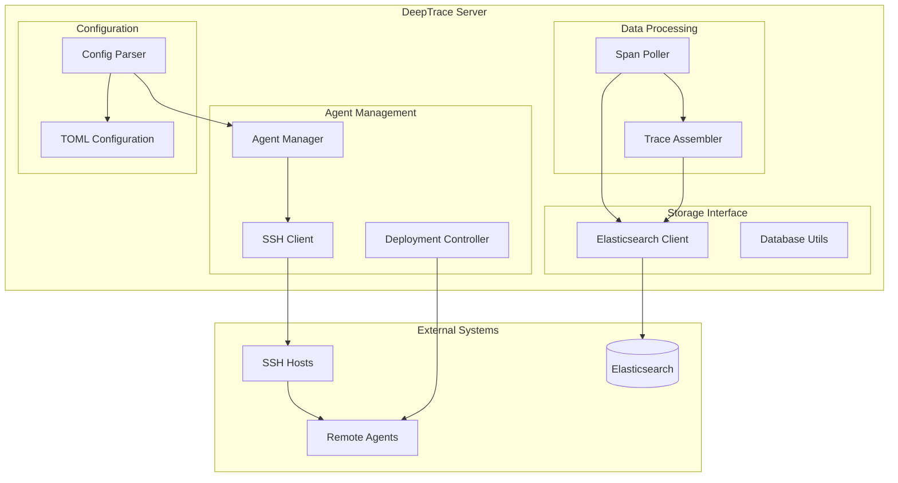

# Server Architecture

The DeepTrace Server is a Python-based distributed system responsible for managing agents, processing correlated spans from Elasticsearch, performing trace assembly, and providing management interfaces. This document provides a detailed overview of the server's architecture, components, and operational principles based on the actual implementation.

## Overview

The DeepTrace Server operates as a centralized control and processing system that:
1. **Manages Agent Lifecycle**: Deploys, configures, and monitors distributed agents
2. **Processes Correlated Span Data**: Retrieves correlated spans from Elasticsearch for assembly
3. **Performs Trace Assembly**: Assembles correlated spans into complete distributed traces
4. **Provides Management Interface**: Offers APIs and tools for system administration

## Architecture Diagram



## Core Components

### 1. Agent Management System

The server provides comprehensive agent lifecycle management:

#### Agent Class
- **Purpose**: Represents and manages individual agent instances
- **Key Features**:
  - SSH-based remote command execution
  - Configuration synchronization
  - Code deployment and installation
  - Process management (start/stop/restart)
  - Health monitoring and status tracking

#### Agent Operations
```python
class Agent:
    def __init__(self, agent_config, elastic_config, server_config):
        # SSH connection management
        self.ssh_client = None
        self.host_ip = agent_config['agent_info']['host_ip']
        self.ssh_port = agent_config['agent_info']['ssh_port']
        self.user_name = agent_config['agent_info']['user_name']
        self.host_password = agent_config['agent_info']['host_password']
    
    def clone_code(self):
        # Git clone from repository
        repo_url = 'https://gitee.com/gytlll/DeepTrace.git'
        
    def install(self):
        # Run installation script
        command = "bash scripts/install_agent.sh"
        
    def sync_config(self):
        # Generate and deploy TOML configuration
        
    def run(self):
        # Start agent process
        command = "bash scripts/run_agent.sh"
        
    def stop(self):
        # Stop agent process
        command = "bash scripts/stop_agent.sh"
```

#### Configuration Management
- **Dynamic Configuration**: Generates agent-specific TOML configurations
- **Hot Reload**: Supports runtime configuration updates via API
- **Template System**: Uses server configuration to generate agent configs
- **Validation**: Ensures configuration consistency across agents

### 2. Data Processing Pipeline

The server implements a sophisticated data processing pipeline:

#### Span Polling
- **Purpose**: Continuously retrieves new spans from Elasticsearch
- **Implementation**: `poll_agents_new_spans()` function
- **Features**:
  - Multi-agent span collection
  - Configurable polling intervals
  - Queue-based processing
  - Error handling and retry logic

#### Trace Assembly Engine
```python
def span2trace(correlated_spans):
    # Step 1: Process correlated spans
    spans = process_correlated_spans(correlated_spans)
    
    # Step 2: Span merging
    span_list = span_merge(spans)
    
    # Step 3: Trace assembly
    trace_num = assemble_trace_from_spans(span_list, 'traces')
```

#### Processing Components
1. **Span Processing**: Processes correlated spans from agents
2. **Span Merge**: Consolidates related spans
3. **Trace Assembler**: Builds complete trace structures from correlated spans

### 3. Storage Interface

The server provides comprehensive Elasticsearch integration:

#### Database Utilities
- **Connection Management**: Elasticsearch client initialization
- **Index Management**: Automatic index creation and management
- **Bulk Operations**: Efficient batch data operations
- **Query Interface**: Structured query building and execution

#### Key Functions
```python
def es_write_agent_config(agent_config, elastic_config, server_config):
    # Store agent configuration in Elasticsearch
    
def poll_agents_new_spans(agents, queue, interval):
    # Retrieve new spans from multiple agents
    
def check_db():
    # Verify database connectivity and health
```

### 4. Configuration System

The server uses a TOML-based configuration system:

#### Configuration Structure
```toml
[elastic]
elastic_password = "password"  # Elasticsearch authentication

[server]
ip = "server_ip"              # Server external IP

[[agents]]
  [agents.agent_info]
  agent_name = "agent1"        # Unique agent identifier
  user_name = "username"       # SSH username
  host_ip = "agent_ip"         # Agent host IP
  ssh_port = 22                # SSH port
  host_password = "password"   # SSH password
```

#### Configuration Features
- **Multi-Agent Support**: Array-based agent configuration
- **Environment Specific**: Separate configs for different environments
- **Validation**: Schema validation and error handling
- **Dynamic Loading**: Runtime configuration reloading

## Data Flow Architecture

### 1. Agent Management Flow
```
Configuration → Agent Creation → SSH Connection → Remote Operations
```

### 2. Span Processing Flow
```
Elasticsearch → Span Polling → Queue → Assembly → Storage
```

### 3. Deployment Flow
```
Config Parsing → Agent Initialization → Code Clone → Installation → Configuration Sync → Agent Start
```

## Operational Modes

The server supports different operational modes:

### Automatic Mode
- **Default Operation**: Continuous correlated span processing
- **Background Processing**: Automated trace assembly
- **Health Monitoring**: Continuous agent health checks

### Manual Mode
- **Interactive Control**: Manual agent management
- **Debug Mode**: Enhanced logging and debugging
- **Maintenance Mode**: System maintenance operations

## Management Interface

### Command Line Interface
The server provides various management utilities:

#### Agent Management
```python
def install_agents(agents):
    # Parallel agent installation
    
def start_agents(agents):
    # Start all configured agents
    
def stop_agents(agents):
    # Stop all running agents
    
def update_agent_config(agents):
    # Hot reload agent configurations
    
def test_agents(agents):
    # Test agent connectivity and health
```

#### Monitoring Functions
- **Health Checks**: Agent connectivity and status monitoring
- **Performance Metrics**: Processing statistics and performance data
- **Error Tracking**: Comprehensive error logging and tracking
- **Resource Monitoring**: System resource usage tracking

## Deployment Architecture

### Server Requirements
- **Python Runtime**: Python 3.x with required dependencies
- **Network Access**: SSH access to agent hosts
- **Elasticsearch**: Connection to Elasticsearch cluster
- **Configuration**: Proper TOML configuration files

### Agent Deployment Process
1. **Code Distribution**: Git clone from central repository
2. **Installation**: Automated installation via scripts
3. **Configuration**: Dynamic configuration generation and deployment
4. **Service Management**: Systemd or process-based service management
5. **Health Monitoring**: Continuous health and status monitoring

## Security Considerations

### Authentication and Authorization
- **SSH Key Management**: Secure SSH key-based authentication
- **Elasticsearch Security**: Secure Elasticsearch connections
- **Configuration Security**: Encrypted configuration storage
- **Network Security**: Secure network communications

### Data Protection
- **Encryption in Transit**: TLS/SSL for all network communications
- **Access Control**: Role-based access control for server operations
- **Audit Logging**: Comprehensive audit trails for all operations
- **Credential Management**: Secure credential storage and rotation

## Performance Characteristics

### Processing Capacity
- **Span Throughput**: Processes thousands of correlated spans per minute
- **Assembly Performance**: Efficient trace assembly algorithms
- **Storage Performance**: Optimized Elasticsearch operations
- **Agent Management**: Concurrent agent operations

### Scalability Features
- **Horizontal Scaling**: Multiple server instances for load distribution
- **Agent Scaling**: Support for hundreds of distributed agents
- **Storage Scaling**: Elasticsearch cluster scaling support
- **Processing Scaling**: Parallel processing capabilities

## Troubleshooting and Monitoring

### Common Issues

#### Agent Connectivity
```bash
# Test SSH connectivity
ssh user@agent_host

# Check agent status
sudo systemctl status deeptrace-agent

# View agent logs
sudo journalctl -u deeptrace-agent -f
```

#### Processing Issues
```python
# Check Elasticsearch connectivity
from elasticsearch import Elasticsearch
es = Elasticsearch([{'host': 'localhost', 'port': 9200}])
print(es.ping())

# Monitor span processing
log(f"Processing {len(spans)} spans")
log(f"Assembled {trace_num} traces")
```

### Monitoring Best Practices
1. **Health Monitoring**: Regular agent health checks
2. **Performance Monitoring**: Track processing metrics
3. **Error Monitoring**: Monitor error rates and patterns
4. **Resource Monitoring**: Track system resource usage
5. **Log Analysis**: Regular log analysis for issues

## Integration Points

### External Systems
- **Elasticsearch**: Primary data storage and retrieval
- **Git Repository**: Source code management and distribution
- **SSH Infrastructure**: Remote agent management
- **Monitoring Systems**: Integration with external monitoring

### API Interfaces
- **Agent APIs**: Communication with agent REST APIs
- **Elasticsearch APIs**: Direct Elasticsearch integration
- **Management APIs**: Server management and control interfaces
- **Monitoring APIs**: Health and status reporting interfaces

---

This server architecture provides a comprehensive foundation for distributed tracing management, offering scalable agent management, efficient data processing, and robust operational capabilities.
