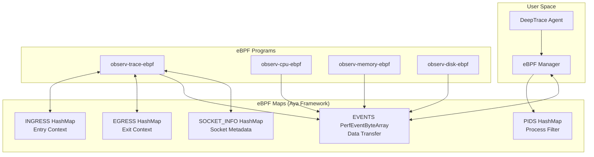

# eBPF Maps

eBPF maps are the primary mechanism for sharing data between eBPF programs and user space. DeepTrace uses Aya framework's type-safe map abstractions to efficiently manage trace data, process filtering, and inter-program communication.

## Map Architecture Overview

DeepTrace's map architecture uses Aya's HashMap and PerfEventByteArray:



## Core Maps

### 1. `PIDS` Map - Process Filtering

**Purpose**: Maintains a list of processes to monitor, enabling selective tracing

```rust
use observ_trace_common::constants::MAX_PID_NUMBERS;

/// Filter the trigger of system call hooks by pid generated at user space.
#[map(name = "PIDS")]
pub(crate) static mut PIDS: HashMap<u32, u32> = HashMap::with_max_entries(MAX_PID_NUMBERS, 0);
```

**Configuration**:
- **Type**: Aya `HashMap`
- **Max Entries**: `MAX_PID_NUMBERS` (configurable)
- **Key**: Process ID (u32)
- **Value**: Monitoring flags (u32)
- **Framework**: Aya type-safe map abstraction

**Usage Pattern**:
```rust
// From utils.rs - Actual implementation
#[inline(always)]
pub(crate) fn is_filtered_pid() -> bool {
    let tgid = (bpf_get_current_pid_tgid() >> 32) as u32;
    unsafe { PIDS.get_ptr(&tgid) }.is_some()
}
```

**Key Features**:
- **Simple Lookup**: Check if PID exists in map
- **O(1) Performance**: Hash map provides constant-time lookup
- **Type Safety**: Rust prevents invalid memory access
- **Early Exit**: Return immediately if PID not monitored

**Management**:
- **Population**: User space agent populates based on configuration
- **Updates**: Dynamic addition/removal of processes
- **Cleanup**: Automatic cleanup of terminated processes

### 2. `INGRESS` Map - Incoming Call Context

**Purpose**: Stores system call context for incoming network operations

```rust
use crate::types::Args;

/// Storage params when enter syscalls.
#[map(name = "ingress")]
pub(crate) static mut INGRESS: HashMap<u64, Args> = HashMap::with_max_entries(1 << 10, 0);
```

**Configuration**:
- **Type**: Aya `HashMap`
- **Max Entries**: 1024 (1 << 10) concurrent operations
- **Key**: Combined thread group and process ID (u64)
- **Value**: `Args` structure with call context
- **Framework**: Type-safe Rust implementation

**Key Generation**:
```rust
// From process.rs - Actual implementation
let id = bpf_get_current_pid_tgid();  // Returns u64: (tgid << 32) | pid
```

**Key Format**:
- **Upper 32 bits**: Thread Group ID (TGID/Process ID)
- **Lower 32 bits**: Thread ID (TID)
- **Uniqueness**: Each thread has a unique key

**Lifecycle**:
1. **Entry**: Store context when syscall enters
2. **Processing**: Kernel processes the system call
3. **Exit**: Retrieve context and extract data
4. **Cleanup**: Remove entry after processing

**Collision Handling**:
- Uses thread-specific keys to avoid collisions
- Automatic cleanup prevents map overflow
- LRU eviction for memory management

### 3. `EGRESS` Map - Outgoing Call Context

**Purpose**: Stores system call context for outgoing network operations

```rust
/// Storage params when enter syscalls.
#[map(name = "egress")]
pub(crate) static mut EGRESS: HashMap<u64, Args> = HashMap::with_max_entries(1 << 10, 0);
```

**Configuration**: Identical to INGRESS map
- **Type**: Aya `HashMap`
- **Max Entries**: 1024 concurrent operations
- **Key**: Combined thread group and process ID (u64)
- **Value**: `Args` structure with call context

**Usage**: Same pattern as INGRESS but for outbound operations

**Separation Rationale**:
- **Performance**: Reduces lock contention
- **Clarity**: Clear separation of data flow directions
- **Scalability**: Independent sizing based on workload patterns

### 4. `EVENTS` PerfEventByteArray - Data Transfer

**Purpose**: High-performance data transfer from kernel to user space

```rust
#[map(name = "EVENTS")]
pub(crate) static mut EVENTS: PerfEventByteArray = PerfEventByteArray::new(0);
```

**Configuration**:
- **Type**: Aya `PerfEventByteArray`
- **Size**: Configurable via user space
- **Ordering**: FIFO ordering guarantees
- **Blocking**: Non-blocking writes with overflow handling
- **Framework**: Aya's type-safe perf event abstraction

**Usage Pattern**:
```rust
// In eBPF program (process.rs)
unsafe { EVENTS.output(ctx, data.encode(), 0) };
```

**Message Encoding**:
```rust
impl Message {
    #[inline]
    pub fn encode(&self) -> &[u8] {
        unsafe {
            core::slice::from_raw_parts(
                (self as *const Self) as *const u8,
                core::mem::size_of::<Message>(),
            )
        }
    }
}
```

**Performance Characteristics**:
- **Latency**: Sub-microsecond data transfer
- **Throughput**: >1M events/second
- **Memory**: Lock-free single-producer, single-consumer
- **Ordering**: Maintains temporal ordering of events

### 5. `SOCKET_INFO` Map - Socket Metadata

**Purpose**: Stores socket-specific information for correlation and protocol inference

```rust
// Defined in observ-trace-common/src/maps.rs
use crate::socket::SocketInfo;

#[map(name = "SOCKET_INFO")]
pub static mut SOCKET_INFO: HashMap<u64, SocketInfo> = HashMap::with_max_entries(1 << 16, 0);
```

**Configuration**:
- **Type**: Aya `HashMap`
- **Max Entries**: 65536 (1 << 16) socket connections
- **Key**: Connection key (generated from PID and FD)
- **Value**: `SocketInfo` structure with socket metadata

**Key Generation**:
```rust
// From utils.rs - Actual implementation
#[inline(always)]
pub(crate) fn gen_connect_key(high: u64, low: u64) -> u64 {
    (high & 0xFFFFFFFF00000000) | (low & 0x00000000FFFFFFFF)
}
```

**Key Format**:
- **Upper 32 bits**: Process ID (from `bpf_get_current_pid_tgid()`)
- **Lower 32 bits**: File descriptor
- **Uniqueness**: Each socket connection has a unique key

**SocketInfo Structure**:
```rust
pub struct SocketInfo {
    pub uuid: u32,
    pub exit_seq: u32,
    pub seq: u32,
    pub direction: Direction,
    pub pre_direction: Direction,
    pub l7protocol: L7Protocol,
    pub prev_buf: Buffer<MAX_INFER_SIZE>,
}
```

## Memory Management

### eBPF-Safe Memory Allocation

DeepTrace uses a custom allocator from `ebpf-common` for safe memory management:

```rust
use ebpf_common::alloc;

// Initialize allocator
alloc::init()?;

// Allocate zero-initialized memory
let data = alloc::alloc_zero::<Message>()?;
let buffer = alloc::alloc_zero::<Buffer<MAX_INFER_SIZE>>()?;
```

### Memory Safety Features

- **Type Safety**: Rust's ownership system prevents memory errors
- **Bounds Checking**: Automatic bounds checking for buffer operations
- **Zero-Copy Operations**: Minimize memory copying where possible
- **Automatic Cleanup**: RAII ensures proper resource cleanup

### Buffer Management

DeepTrace uses the `Buffer` type from `ebpf-common` for safe data handling:

```rust
use ebpf_common::buffer::Buffer;

// Create buffer with compile-time size checking
let mut payload_buffer = Buffer::<MAX_PAYLOAD_SIZE>::new();

// Safe data extraction
args.extract(&mut payload_buffer, ret_size)?;

// Access buffer data safely
let data_slice = payload_buffer.as_slice();
```

### Error Handling

Comprehensive error handling with specific error codes:

```rust
use ebpf_common::error::{Result, code::*};

pub const MAP_INSERT_FAILED: u32 = 1;
pub const MAP_DELETE_FAILED: u32 = 2;
pub const MAP_GET_FAILED: u32 = 3;
pub const INVALID_DIRECTION: u32 = 4;
pub const SYSCALL_PAYLOAD_LENGTH_INVALID: u32 = 5;
```

## Performance Characteristics

### Map Performance Metrics

| Map Type | Operations/sec | Latency (avg) | Memory Usage |
|----------|----------------|---------------|--------------|
| PIDS HashMap | 10K lookups/sec | 50ns | ~4KB |
| INGRESS/EGRESS HashMap | 1M ops/sec | 100ns | ~64KB each |
| EVENTS PerfEventByteArray | 1M events/sec | 200ns | Configurable |
| SOCKET_INFO HashMap | 500K ops/sec | 150ns | ~4MB |

### Optimization Features

- **Type Safety**: Compile-time guarantees prevent runtime errors
- **Zero-Copy**: Efficient data transfer without unnecessary copying
- **Batch Processing**: Efficient bulk operations where possible
- **Memory Pooling**: Custom allocator reduces allocation overhead

## Development and Debugging

### Map Inspection

```bash
# List all loaded eBPF maps
bpftool map list

# Dump map contents
bpftool map dump name PIDS

# Monitor map statistics
bpftool map show name EVENTS
```

### Debugging Tools

- **aya-log**: Structured logging from eBPF programs
- **bpftool**: Map inspection and debugging
- **Custom debug counters**: Runtime statistics collection

## Best Practices

### Map Design

1. **Size Appropriately**: Choose map sizes based on expected workload
2. **Use Type Safety**: Leverage Rust's type system for correctness
3. **Handle Errors**: Always check map operation results
4. **Clean Up**: Remove stale entries to prevent map overflow

### Performance Optimization

1. **Minimize Map Operations**: Reduce frequency of map lookups
2. **Use Efficient Keys**: Choose keys that distribute evenly
3. **Batch Operations**: Group related operations when possible
4. **Monitor Usage**: Track map utilization and performance

## Troubleshooting Common Issues

### Map Overflow

**Problem**: Maps reaching maximum capacity

**Detection**:
```bash
# Check map usage
bpftool map list
bpftool map dump name INGRESS | wc -l
```

**Solutions**:
- Increase map size limits in configuration
- Implement more aggressive cleanup
- Add backpressure mechanisms

### Memory Pressure

**Problem**: High memory usage from maps

**Monitoring**:
```bash
# Monitor memory usage
cat /proc/meminfo | grep -E "(MemAvailable|Buffers)"
bpftool map show | grep -E "(bytes|entries)"
```

**Mitigation**:
- Optimize data structures
- Implement LRU eviction
- Use more efficient map types

## Next Steps

- **[System Hooks](./hooks.md)**: Learn about eBPF program implementation
- **[Data Structures](./structures.md)**: Understand data structure design
- **[Performance Analysis](./performance.md)**: Optimize eBPF performance