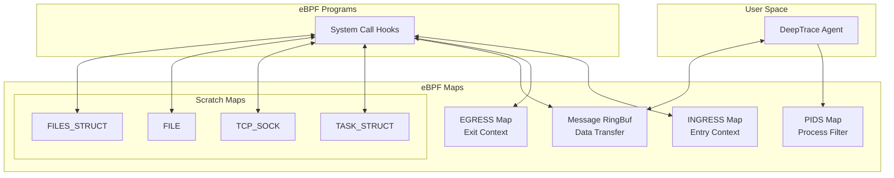

# eBPF Maps

eBPF maps are the primary mechanism for sharing data between eBPF programs and user space, as well as storing state within the kernel. DeepTrace uses a carefully designed set of maps to efficiently manage trace data, process filtering, and inter-program communication.

## Map Architecture Overview

DeepTrace's map architecture follows a layered approach:



## Core Maps

### 1. `PIDS` Map - Process Filtering

**Purpose**: Maintains a list of processes to monitor, enabling selective tracing

```c
struct {
    __uint(type, BPF_MAP_TYPE_HASH);
    __uint(max_entries, 256);
    __type(key, u32);      // Process ID (tgid)
    __type(value, u32);    // Monitoring flags
} PIDS SEC(".maps");
```

**Configuration**:
- **Type**: `BPF_MAP_TYPE_HASH`
- **Max Entries**: 256 processes
- **Key**: Process ID (tgid)
- **Value**: Monitoring configuration flags

**Usage Pattern**:
```c
static inline bool should_monitor_process(u32 tgid) {
    u32 *flags = bpf_map_lookup_elem(&PIDS, &tgid);
    return flags != NULL && (*flags & MONITOR_FLAG_ENABLED);
}
```

**Value Flags**:
```c
#define MONITOR_FLAG_ENABLED    0x01  // Basic monitoring
#define MONITOR_FLAG_PAYLOAD    0x02  // Capture payload data
#define MONITOR_FLAG_VERBOSE    0x04  // Detailed logging
#define MONITOR_FLAG_PROTOCOLS  0x08  // Protocol-specific parsing
```

**Management**:
- **Population**: User space agent populates based on configuration
- **Updates**: Dynamic addition/removal of processes
- **Cleanup**: Automatic cleanup of terminated processes

### 2. `INGRESS` Map - Incoming Call Context

**Purpose**: Stores system call context for incoming network operations

```c
struct {
    __uint(type, BPF_MAP_TYPE_HASH);
    __uint(max_entries, 10240);
    __type(key, u64);           // (tgid << 32) | pid
    __type(value, struct Args); // System call arguments
} INGRESS SEC(".maps");
```

**Configuration**:
- **Type**: `BPF_MAP_TYPE_HASH`
- **Max Entries**: 10,240 concurrent operations
- **Key**: Combined thread group and process ID
- **Value**: `Args` structure with call context

**Key Generation**:
```c
static inline u64 generate_thread_key(void) {
    u64 pid_tgid = bpf_get_current_pid_tgid();
    return pid_tgid;  // Already in correct format: (tgid << 32) | pid
}
```

**Lifecycle**:
1. **Entry**: Store context when syscall enters
2. **Processing**: Kernel processes the system call
3. **Exit**: Retrieve context and extract data
4. **Cleanup**: Remove entry after processing

**Collision Handling**:
- Uses thread-specific keys to avoid collisions
- Automatic cleanup prevents map overflow
- LRU eviction for memory management

### 3. `EGRESS` Map - Outgoing Call Context

**Purpose**: Stores system call context for outgoing network operations

```c
struct {
    __uint(type, BPF_MAP_TYPE_HASH);
    __uint(max_entries, 10240);
    __type(key, u64);           // (tgid << 32) | pid
    __type(value, struct Args); // System call arguments
} EGRESS SEC(".maps");
```

**Configuration**: Identical to INGRESS map
**Usage**: Same pattern as INGRESS but for outbound operations

**Separation Rationale**:
- **Performance**: Reduces lock contention
- **Clarity**: Clear separation of data flow directions
- **Scalability**: Independent sizing based on workload patterns

### 4. `Message` RingBuf - Data Transfer

**Purpose**: High-performance data transfer from kernel to user space

```c
struct {
    __uint(type, BPF_MAP_TYPE_RINGBUF);
    __uint(max_entries, sizeof(struct Data) * (1 << 12)); // 4096 entries
} Message SEC(".maps");
```

**Configuration**:
- **Type**: `BPF_MAP_TYPE_RINGBUF`
- **Size**: ~16MB (4096 × 4KB per entry)
- **Ordering**: FIFO ordering guarantees
- **Blocking**: Non-blocking writes with overflow handling

**Usage Pattern**:
```c
static inline int send_trace_data(struct Data *data) {
    // Reserve space in ring buffer
    struct Data *rb_data = bpf_ringbuf_reserve(&Message, sizeof(*data), 0);
    if (!rb_data) {
        return -ENOMEM;  // Buffer full
    }
    
    // Copy data to reserved space
    __builtin_memcpy(rb_data, data, sizeof(*data));
    
    // Submit to user space
    bpf_ringbuf_submit(rb_data, 0);
    return 0;
}
```

**Performance Characteristics**:
- **Latency**: Sub-microsecond data transfer
- **Throughput**: >1M events/second
- **Memory**: Lock-free single-producer, single-consumer
- **Ordering**: Maintains temporal ordering of events

## Scratch Maps (Per-CPU Arrays)

These maps provide temporary storage for large kernel structures that exceed eBPF stack limits.

### 5. `TASK_STRUCT` Map

**Purpose**: Safe access to process information

```c
struct {
    __uint(type, BPF_MAP_TYPE_PERCPU_ARRAY);
    __uint(max_entries, 1);
    __type(key, u32);
    __type(value, struct task_struct);
} TASK_STRUCT SEC(".maps");
```

**Configuration**:
- **Type**: `BPF_MAP_TYPE_PERCPU_ARRAY`
- **Entries**: 1 per CPU
- **Size**: ~13,696 bytes (kernel version dependent)
- **Purpose**: Avoid stack overflow when accessing task information

**Usage**:
```c
static inline struct task_struct* get_current_task_safe(void) {
    u32 key = 0;
    struct task_struct *task = bpf_map_lookup_elem(&TASK_STRUCT, &key);
    if (!task) return NULL;
    
    // Copy current task info
    struct task_struct *current_task = (struct task_struct *)bpf_get_current_task();
    bpf_probe_read_kernel(task, sizeof(*task), current_task);
    
    return task;
}
```

### 6. `TCP_SOCK` Map

**Purpose**: Access TCP socket state information

```c
struct {
    __uint(type, BPF_MAP_TYPE_PERCPU_ARRAY);
    __uint(max_entries, 1);
    __type(key, u32);
    __type(value, struct tcp_sock);
} TCP_SOCK SEC(".maps");
```

**Configuration**:
- **Size**: ~2,304 bytes
- **Usage**: TCP sequence numbers, connection state
- **Access Pattern**: Per-syscall temporary storage

**Key Information Extracted**:
```c
static inline int extract_tcp_info(int fd, struct tcp_sock *tcp_sk) {
    // Get socket from file descriptor
    struct socket *sock = get_socket_from_fd(fd);
    if (!sock || sock->sk->sk_protocol != IPPROTO_TCP) {
        return -1;
    }
    
    // Copy TCP socket information
    bpf_probe_read_kernel(tcp_sk, sizeof(*tcp_sk), sock->sk);
    return 0;
}
```

### 7. `FILE` Map

**Purpose**: File descriptor information access

```c
struct {
    __uint(type, BPF_MAP_TYPE_PERCPU_ARRAY);
    __uint(max_entries, 1);
    __type(key, u32);
    __type(value, struct file);
} FILE SEC(".maps");
```

**Configuration**:
- **Size**: 232 bytes
- **Usage**: File operations and socket identification
- **Scope**: Per-CPU temporary storage

### 8. `FILES_STRUCT` Map

**Purpose**: Process file descriptor table access

```c
struct {
    __uint(type, BPF_MAP_TYPE_PERCPU_ARRAY);
    __uint(max_entries, 1);
    __type(key, u32);
    __type(value, struct files_struct);
} FILES_STRUCT SEC(".maps");
```

**Configuration**:
- **Size**: 704 bytes
- **Usage**: File descriptor resolution
- **Access**: Process file table operations

## Map Management Strategies

### Memory Optimization

#### Size Calculation
```c
// Calculate optimal map sizes based on workload
#define CONCURRENT_THREADS_MAX    1024
#define SAFETY_FACTOR            10
#define INGRESS_MAP_SIZE         (CONCURRENT_THREADS_MAX * SAFETY_FACTOR)

// Ring buffer sizing
#define EVENTS_PER_SECOND        100000
#define BUFFER_DURATION_MS       100
#define RINGBUF_ENTRIES          ((EVENTS_PER_SECOND * BUFFER_DURATION_MS) / 1000)
```

#### Memory Layout Optimization
```c
// Align structures for optimal memory access
struct __attribute__((packed)) OptimizedArgs {
    u32 fd;
    u32 seq;
    u64 timestamp;
    // Buffer info follows...
};
```

### Concurrency Control

#### Lock-Free Operations
```c
// Use atomic operations for counters
static inline void increment_counter(u32 counter_id) {
    u32 *counter = bpf_map_lookup_elem(&COUNTERS, &counter_id);
    if (counter) {
        __sync_fetch_and_add(counter, 1);
    }
}
```

#### Per-CPU Design Benefits
- **No Locking**: Each CPU has its own map instance
- **Cache Locality**: Better CPU cache utilization
- **Scalability**: Linear scaling with CPU count

### Cleanup and Maintenance

#### Automatic Cleanup
```c
static inline void cleanup_stale_entries(void) {
    u64 current_time = bpf_ktime_get_ns();
    u64 timeout_ns = 5 * 1000000000ULL; // 5 seconds
    
    // Iterate through entries and remove stale ones
    // (Implementation depends on map iteration support)
}
```

#### Memory Pressure Handling
```c
static inline int handle_map_full(void) {
    // Implement LRU eviction or other strategies
    // Return error codes to user space for handling
    return -ENOSPC;
}
```

## Performance Characteristics

### Throughput Metrics

| Map Type | Operations/sec | Latency (avg) | Memory Usage |
|----------|----------------|---------------|--------------|
| PIDS | 10K lookups/sec | 50ns | 4KB |
| INGRESS/EGRESS | 1M ops/sec | 100ns | 320KB |
| Message RingBuf | 1M events/sec | 200ns | 16MB |
| Scratch Maps | 10M ops/sec | 20ns | 64KB |

### Memory Footprint

```c
// Total memory usage calculation
#define PIDS_MEMORY        (256 * (sizeof(u32) + sizeof(u32)))
#define INGRESS_MEMORY     (10240 * (sizeof(u64) + sizeof(struct Args)))
#define EGRESS_MEMORY      (10240 * (sizeof(u64) + sizeof(struct Args)))
#define RINGBUF_MEMORY     (4096 * sizeof(struct Data))
#define SCRATCH_MEMORY     (4 * (13696 + 2304 + 232 + 704)) // Per-CPU

#define TOTAL_MEMORY       (PIDS_MEMORY + INGRESS_MEMORY + EGRESS_MEMORY + \
                           RINGBUF_MEMORY + SCRATCH_MEMORY)
// Approximately 20MB total
```

## Debugging and Monitoring

### Map Statistics

```c
// Debug counters for map operations
enum map_stats {
    STAT_PIDS_LOOKUPS = 0,
    STAT_INGRESS_INSERTS = 1,
    STAT_EGRESS_INSERTS = 2,
    STAT_RINGBUF_SUBMISSIONS = 3,
    STAT_MAP_ERRORS = 4,
};

struct {
    __uint(type, BPF_MAP_TYPE_ARRAY);
    __uint(max_entries, 16);
    __type(key, u32);
    __type(value, u64);
} MAP_STATS SEC(".maps");
```

### Error Tracking

```c
static inline void record_map_error(enum map_error_type error) {
    u32 key = STAT_MAP_ERRORS;
    u64 *counter = bpf_map_lookup_elem(&MAP_STATS, &key);
    if (counter) {
        __sync_fetch_and_add(counter, 1);
    }
}
```

## Troubleshooting Common Issues

### Map Overflow

**Problem**: Maps reaching maximum capacity

**Detection**:
```bash
# Check map usage
bpftool map show
bpftool map dump id <map_id> | wc -l
```

**Solutions**:
- Increase map size limits
- Implement more aggressive cleanup
- Add backpressure mechanisms

### Memory Pressure

**Problem**: High memory usage from maps

**Monitoring**:
```bash
# Monitor memory usage
cat /proc/meminfo | grep -E "(MemAvailable|Buffers)"
bpftool map show | grep -E "(bytes|entries)"
```

**Mitigation**:
- Optimize data structures
- Implement LRU eviction
- Use more efficient map types

### Performance Degradation

**Problem**: Slow map operations

**Profiling**:
```bash
# Profile map performance
perf record -g bpftool map lookup id <map_id>
perf report
```

**Optimization**:
- Use per-CPU maps where possible
- Optimize key/value sizes
- Implement batching for bulk operations

---

DeepTrace's eBPF maps provide a robust and efficient foundation for high-performance network tracing, carefully balancing memory usage, performance, and functionality requirements.
