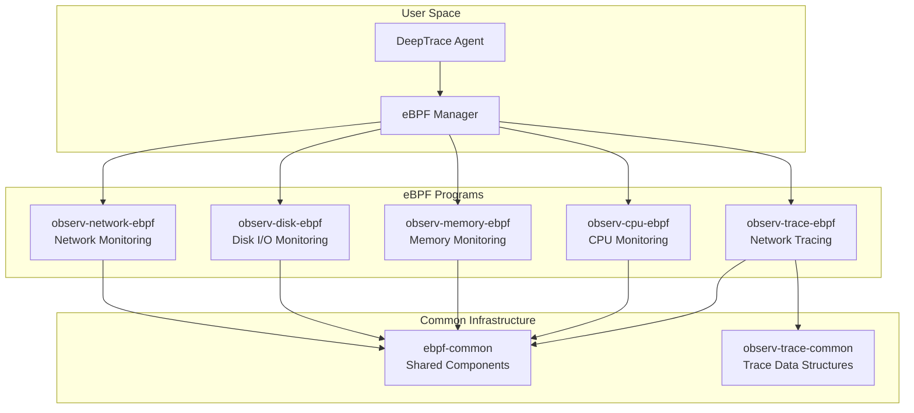
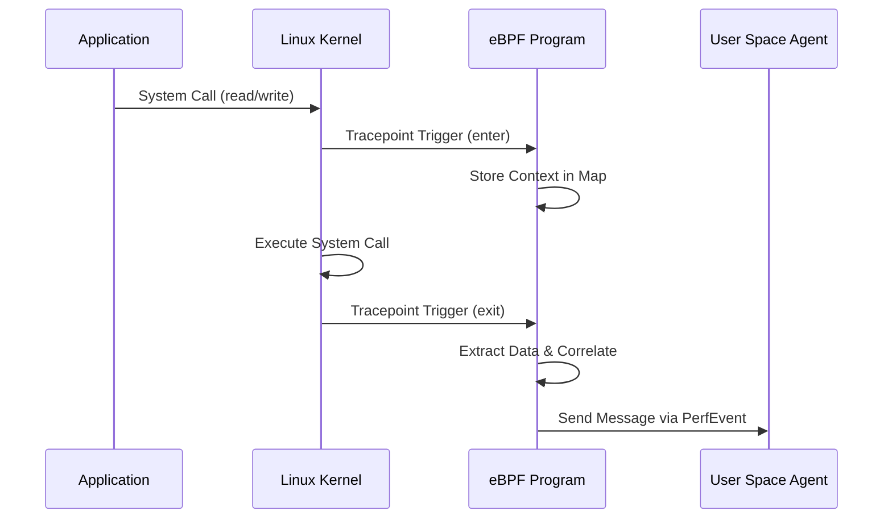

# eBPF Overview

DeepTrace's eBPF implementation provides non-intrusive distributed tracing through kernel-level network monitoring. The implementation is built using the Aya framework and consists of multiple specialized eBPF programs for different system observability aspects.

## Architecture Overview

DeepTrace's eBPF implementation follows a modular architecture with specialized programs for different observability domains:



## Core Components

### 1. observ-trace-ebpf - Network Tracing

The primary eBPF program for distributed tracing, monitoring network system calls:

**Monitored System Calls**:
- **Ingress**: `read`, `readv`, `recvfrom`, `recvmsg`, `recvmmsg`
- **Egress**: `write`, `writev`, `sendto`, `sendmsg`, `sendmmsg`
- **Socket Management**: `socket`, `close`

**Key Features**:
- Tracepoint-based system call interception
- Protocol-aware payload extraction
- TCP sequence number tracking
- Process filtering by PID
- Real-time span correlation

### 2. ebpf-common - Shared Infrastructure

Provides common functionality used across all eBPF programs:

**Core Modules**:
- **CO-RE Support**: Kernel compatibility across versions
- **Buffer Management**: Efficient data handling
- **Memory Allocation**: eBPF-safe memory management
- **Error Handling**: Comprehensive error codes
- **Utility Functions**: Common helper functions

### 3. observ-trace-common - Trace Data Structures

Defines shared data structures between eBPF and user space:

**Key Structures**:
- `Message`: Complete trace record
- `Quintuple`: Network flow identifier
- `SocketInfo`: Socket metadata
- `Direction`: Ingress/Egress classification
- `Syscall`: System call enumeration

### 4. Additional Observability Programs

- **observ-cpu-ebpf**: CPU performance monitoring
- **observ-memory-ebpf**: Memory usage tracking
- **observ-disk-ebpf**: Disk I/O monitoring
- **observ-network-ebpf**: Network statistics

## Implementation Framework

### Aya Framework

DeepTrace uses the Aya eBPF framework, providing:

- **Rust-native eBPF development**
- **Type-safe eBPF programming**
- **Automatic BTF generation**
- **CO-RE (Compile Once, Run Everywhere) support** (use libbpf)
- **Integration with Rust ecosystem**

### Tracepoint-Based Monitoring

Uses Linux tracepoints for system call interception:

```rust
#[tracepoint(category = "syscalls", name = "sys_enter_read")]
fn sys_enter_read(ctx: TracePointContext) -> u32 {
    // Entry point processing
}

#[tracepoint(category = "syscalls", name = "sys_exit_read")]
fn sys_exit_read(ctx: TracePointContext) -> u32 {
    // Exit point processing
}
```

## Data Flow Architecture

### 1. System Call Interception



### 2. Data Processing Pipeline

1. **Entry Phase**: Store system call context
2. **Execution Phase**: Kernel processes the system call
3. **Exit Phase**: Extract data and build trace message
4. **Correlation Phase**: Apply protocol inference and correlation
5. **Transmission Phase**: Send to user space via PerfEvent

## Memory Management

### eBPF Maps

DeepTrace uses several types of eBPF maps:

```rust
// Process filtering
#[map(name = "PIDS")]
pub static mut PIDS: HashMap<u32, u32> = HashMap::with_max_entries(256, 0);

// System call context storage
#[map(name = "ingress")]
pub static mut INGRESS: HashMap<u64, Args> = HashMap::with_max_entries(1024, 0);

#[map(name = "egress")]
pub static mut EGRESS: HashMap<u64, Args> = HashMap::with_max_entries(1024, 0);

// Data transmission
#[map(name = "EVENTS")]
pub static mut EVENTS: PerfEventByteArray = PerfEventByteArray::new(0);
```

### Memory Allocation

Uses custom eBPF-safe allocator from `ebpf-common`:

```rust
// Initialize allocator
alloc::init()?;

// Allocate zero-initialized memory
let data = alloc::alloc_zero::<Message>()?;
let buffer = alloc::alloc_zero::<Buffer<MAX_INFER_SIZE>>()?;
```

## Protocol Support

### L7 Protocol Inference

Integrated with `l7-parser` for protocol detection:

```rust
let result = protocol_infer(
    ctx,
    &quintuple,
    direction,
    infer_payload,
    key,
    args.enter_seq,
    data.exit_seq,
)?;
```

**Supported Protocols**:
- HTTP/HTTPS
- gRPC
- Redis
- MongoDB
- MySQL
- PostgreSQL
- And more...

## Performance Characteristics

### Overhead Metrics

| Component | Overhead | Impact |
|-----------|----------|--------|
| **System Call Interception** | 2-4μs | Per syscall |
| **Data Extraction** | 1-2μs | Per payload |
| **Protocol Inference** | 0.5-1μs | Per message |
| **Map Operations** | 0.1-0.5μs | Per operation |

### Optimization Features

- **Process Filtering**: Monitor only relevant processes
- **Payload Size Limits**: Configurable data capture
- **Batch Processing**: Efficient data transmission
- **Zero-Copy Operations**: Minimize memory overhead

## Error Handling

Comprehensive error handling with specific error codes:

```rust
pub const MAP_INSERT_FAILED: u32 = 1;
pub const MAP_DELETE_FAILED: u32 = 2;
pub const MAP_GET_FAILED: u32 = 3;
pub const INVALID_DIRECTION: u32 = 4;
pub const SYSCALL_PAYLOAD_LENGTH_INVALID: u32 = 5;
```

## Development and Debugging

### Build System

Uses `cargo xtask` for eBPF compilation:

```bash
# Build eBPF programs
cargo xtask build --profile release

# Build with debug information
cargo xtask build --profile debug
```

### Debugging Tools

- **aya-log**: Structured logging from eBPF
- **bpftool**: eBPF program inspection
- **perf**: Performance analysis
- **Custom debug counters**: Runtime statistics

## Next Steps

- **[System Hooks](./hooks.md)**: Detailed system call implementation
- **[Data Structures](./structures.md)**: eBPF data structure reference
- **[Memory Maps](./maps.md)**: eBPF map configuration and usage
- **[Performance Analysis](./performance.md)**: Performance tuning and optimization
