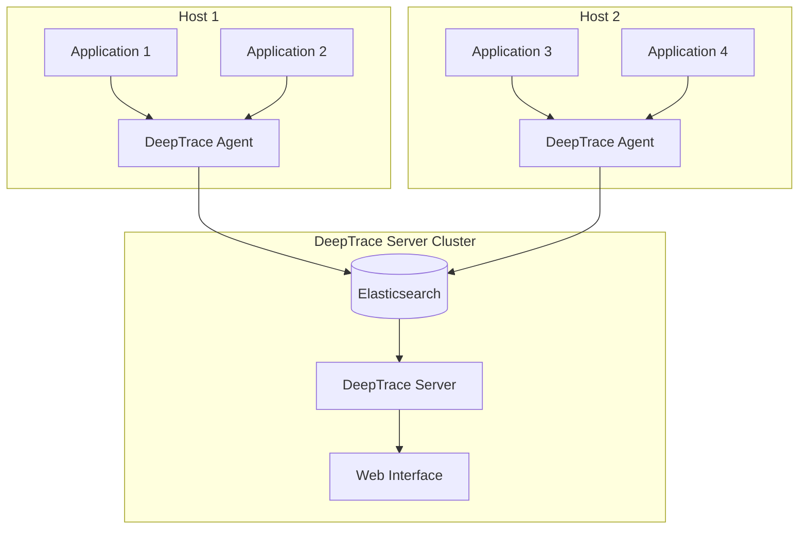

# DeepTrace Documentation

Welcome to the comprehensive documentation for **DeepTrace** - a cutting-edge, non-intrusive distributed tracing framework designed specifically for microservices architectures.

## What is DeepTrace?

**DeepTrace** is a revolutionary distributed tracing framework that enables accurate end-to-end observation of request execution paths in microservices environments **without requiring any code instrumentation**. By leveraging advanced eBPF technology and intelligent transaction semantics, DeepTrace achieves over 95% tracing accuracy even under high concurrency scenarios.

### Key Innovations

🚀 **Non-Intrusive Design**  
No code changes required - DeepTrace works out of the box with your existing applications

🔍 **Protocol-Aware Intelligence**  
Supports 20+ application protocols (HTTP, gRPC, Redis, MongoDB, etc.) with intelligent parsing

🧠 **Transaction-Based Correlation**  
Uses dual-phase transaction inference with API affinity and persistent field similarity

⚡ **High Performance**  
94% reduction in transmission overhead compared to traditional tracing frameworks

## Architecture Overview

DeepTrace consists of two main components:

- **Agent**: Deployed on each host, responsible for non-intrusive request collection and span correlation through eBPF
- **Server**: Runs in Kubernetes clusters, handles trace assembly from correlated spans and provides query services

## Core Features

### 1. Protocol-Aware Span Construction
- **eBPF-based packet capture** for non-intrusive monitoring
- **Protocol templates** for accurate parsing of 20+ protocols
- **Smart request boundary detection** using length-field jumps and full parsing
- **Efficient span creation** with critical metadata extraction

### 2. Transaction-Based Span Correlation
- **Nested API affinity**: Traffic intensity correlations using Pearson coefficients
- **Persistent field similarity**: TF-IDF-weighted cosine similarity for transaction field isolation
- **Entropy-weighted adaptive scoring**: Intelligent fusion of transaction semantics and causality metrics
- **15% reduction in misattributions** compared to traditional delay/FIFO methods

### 3. Query-Driven Trace Assembly
- **On-host compression** and **dual-indexing** for minimal overhead
- **Iterative trace reconstruction** based on operator queries
- **Tag-based inverted indexes** and **metric histograms**
- **94% reduction in transmission overhead** while maintaining query flexibility

## Quick Navigation

### 🚀 Getting Started
New to DeepTrace? Start here:
- [Quick Start Guide](./getting-started/quick-start.md) - Get up and running in 10 minutes
- [Installation](./getting-started/installation.md) - Detailed installation instructions
- [All-in-One Deployment](./getting-started/all-in-one.md) - Single-host setup for testing

### 📖 User Guide
Learn how to use DeepTrace effectively:
- [Basic Usage](./user-guide/basic-usage.md) - Essential operations and workflows
- [Deployment Modes](./user-guide/deployment-modes.md) - Choose the right deployment strategy
- [Trace Analysis](./user-guide/trace-analysis.md) - Analyze and interpret traces

### 🏗️ Architecture & Implementation
Understand how DeepTrace works:
- [System Overview](./architecture/overview.md) - High-level architecture
- [eBPF Implementation](./ebpf/overview.md) - Deep dive into eBPF components
- [Advanced Topics](./advanced/correlation-algorithms.md) - Advanced features and algorithms

### 🔧 Development & Testing
For developers and contributors:
- [Testing Guide](./testing/overview.md) - Comprehensive testing strategies
- [API Reference](./api/agent.md) - Complete API documentation
- [Troubleshooting](./troubleshooting/common-issues.md) - Common issues and solutions

## Supported Environments

DeepTrace has been tested and verified on:

- **Operating System**: Ubuntu 24.04 LTS
- **Kernel Version**: 6.8.0-55-generic or later
- **Container Runtime**: Docker v26.1.3+
- **Orchestration**: Kubernetes 1.20+

## Community & Support

- **GitHub Repository**: [DeepShield-AI/DeepTrace](https://github.com/DeepShield-AI/DeepTrace)
- **Issues & Bug Reports**: [GitHub Issues](https://github.com/DeepShield-AI/DeepTrace/issues)
- **Discussions**: [GitHub Discussions](https://github.com/DeepShield-AI/DeepTrace/discussions)

## License

DeepTrace is released under the [MIT License](./appendix/license.md).