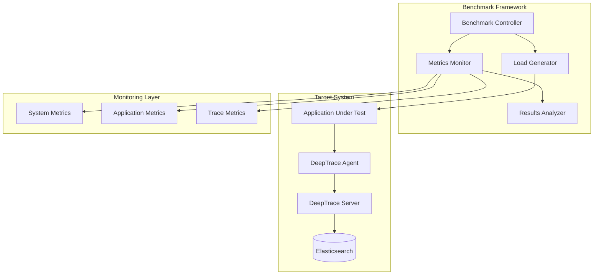

# Performance Benchmarks

DeepTrace's performance benchmarking suite provides comprehensive evaluation of system overhead, scalability characteristics, and resource utilization across various deployment scenarios. This document outlines the benchmarking methodology, test suites, and performance targets.

## Overview

Performance benchmarking in DeepTrace covers:

- **System Overhead**: CPU, memory, and network impact measurement
- **Scalability Testing**: Performance under varying loads and scales
- **Latency Analysis**: End-to-end tracing latency evaluation
- **Throughput Assessment**: Maximum sustainable trace volume
- **Resource Utilization**: Efficient use of system resources

## Benchmark Architecture



## Micro-benchmarks

### System Call Overhead

Measures the performance impact of eBPF instrumentation on individual system calls:

#### Test Suite

Located in `tests/eBPF/overhead/`, the micro-benchmark suite includes:

1. **Network I/O Operations**:
   ```bash
   cd tests/eBPF/overhead
   ./run.sh write      # write() system call
   ./run.sh read       # read() system call
   ./run.sh sendmsg    # sendmsg() system call
   ./run.sh recvmsg    # recvmsg() system call
   ./run.sh sendto     # sendto() system call
   ./run.sh recvfrom   # recvfrom() system call
   ```

2. **Vectored I/O Operations**:
   ```bash
   ./run.sh writev     # writev() system call
   ./run.sh readv      # readv() system call
   ./run.sh sendmmsg   # sendmmsg() batch operations
   ./run.sh recvmmsg   # recvmmsg() batch operations
   ```

3. **SSL/TLS Operations**:
   ```bash
   ./run.sh ssl_write  # SSL_write() overhead
   ./run.sh ssl_read   # SSL_read() overhead
   ./run.sh ssl        # Generic SSL operations
   ```

#### Measurement Methodology

Each test program follows this pattern:

```c
#include <time.h>
#include <sys/socket.h>

#define ITERATIONS 100000
#define BUFFER_SIZE 1024

int main() {
    struct timespec start, end;
    char buffer[BUFFER_SIZE];
    long total_time = 0;
    
    // Warm-up phase
    for (int i = 0; i < 1000; i++) {
        write(fd, buffer, BUFFER_SIZE);
    }
    
    // Measurement phase
    for (int i = 0; i < ITERATIONS; i++) {
        clock_gettime(CLOCK_MONOTONIC, &start);
        write(fd, buffer, BUFFER_SIZE);
        clock_gettime(CLOCK_MONOTONIC, &end);
        
        long duration = (end.tv_sec - start.tv_sec) * 1000000000L +
                       (end.tv_nsec - start.tv_nsec);
        total_time += duration;
    }
    
    printf("Average latency: %ld ns\n", total_time / ITERATIONS);
    return 0;
}
```

#### Performance Targets

| System Call | Target Overhead | Acceptable Range |
|-------------|----------------|------------------|
| write()     | < 2%           | < 5%             |
| read()      | < 2%           | < 5%             |
| sendmsg()   | < 3%           | < 7%             |
| recvmsg()   | < 3%           | < 7%             |
| SSL_write() | < 5%           | < 10%            |
| SSL_read()  | < 5%           | < 10%            |

### eBPF Map Performance

Tests the performance characteristics of different eBPF map types:

```bash
# Hash map performance
./test_maps.sh --type hash --operations 1000000 --key-size 16 --value-size 64

# Array map performance  
./test_maps.sh --type array --operations 1000000 --elements 10000

# Ring buffer performance
./test_maps.sh --type ringbuf --operations 1000000 --size 1MB
```

## Macro-benchmarks

### Application-Level Performance

#### HTTP Server Benchmark

Tests DeepTrace impact on HTTP server performance:

```bash
#!/bin/bash
# benchmark_http_server.sh

# Start HTTP server without DeepTrace
./start_http_server.sh --port 8080 --threads 4
wrk -t12 -c400 -d30s --latency http://localhost:8080/api/test
./collect_baseline_metrics.sh

# Start HTTP server with DeepTrace
./start_deeptrace_agent.sh
./start_http_server.sh --port 8080 --threads 4
wrk -t12 -c400 -d30s --latency http://localhost:8080/api/test
./collect_instrumented_metrics.sh

# Compare results
./compare_performance.sh baseline.json instrumented.json
```

**Expected Results:**
- Latency increase: < 5%
- Throughput decrease: < 3%
- CPU overhead: < 10%
- Memory overhead: < 50MB

#### Database Benchmark

Tests impact on database workloads:

```bash
# OLTP workload
sysbench oltp_read_write \
    --mysql-host=localhost \
    --mysql-user=test \
    --mysql-password=test \
    --mysql-db=testdb \
    --tables=10 \
    --table-size=100000 \
    --threads=16 \
    --time=300 \
    --report-interval=10 \
    run

# Analytics workload
sysbench oltp_read_only \
    --mysql-host=localhost \
    --mysql-user=test \
    --mysql-password=test \
    --mysql-db=testdb \
    --tables=10 \
    --table-size=1000000 \
    --threads=8 \
    --time=300 \
    --report-interval=10 \
    run
```

### Microservices Benchmark

#### BookInfo Performance Test

```bash
cd tests/workload/bookinfo
./deploy.sh

# Generate baseline load
./load_test.sh --duration 300 --rps 100 --baseline

# Generate instrumented load
./start_deeptrace.sh
./load_test.sh --duration 300 --rps 100 --instrumented

# Analyze results
./analyze_bookinfo_performance.sh
```

#### Social Network Performance Test

```bash
cd tests/workload/socialnetwork
./deploy.sh

# Mixed workload test
./social_network_bench.sh \
    --users 1000 \
    --posts-per-minute 500 \
    --reads-per-minute 5000 \
    --duration 600
```

## Scalability Benchmarks

### Horizontal Scaling

Tests performance across multiple hosts:

```bash
# Single host baseline
./deploy_single_host.sh --agents 1
./run_scalability_test.sh --connections 1000 --duration 300

# Multi-host scaling
for hosts in 2 4 8 16; do
    ./deploy_multi_host.sh --hosts $hosts --agents-per-host 1
    ./run_scalability_test.sh --connections $((1000 * hosts)) --duration 300
    ./collect_scaling_metrics.sh --hosts $hosts
done
```

### Vertical Scaling

Tests performance with varying resource allocations:

```bash
# CPU scaling test
for cpus in 1 2 4 8; do
    ./configure_resources.sh --cpus $cpus --memory 4GB
    ./run_cpu_scaling_test.sh --duration 300
done

# Memory scaling test
for memory in 1GB 2GB 4GB 8GB; do
    ./configure_resources.sh --cpus 4 --memory $memory
    ./run_memory_scaling_test.sh --duration 300
done
```

### Load Scaling

Tests performance under varying trace volumes:

```bash
# Trace volume scaling
for rps in 100 500 1000 5000 10000; do
    ./generate_load.sh --requests-per-second $rps --duration 300
    ./measure_trace_processing.sh
done
```

## Performance Metrics

### System Metrics

**CPU Utilization:**
- User CPU time
- System CPU time  
- I/O wait time
- Context switches per second

**Memory Usage:**
- Resident Set Size (RSS)
- Virtual Memory Size (VSZ)
- Page faults per second
- Memory allocation rate

**Network Performance:**
- Bytes sent/received per second
- Packets sent/received per second
- Network errors and drops
- Connection establishment rate

### Application Metrics

**Latency Measurements:**
- Request/response latency (p50, p95, p99)
- End-to-end transaction time
- Database query response time
- Service call latency

**Throughput Metrics:**
- Requests per second
- Transactions per second
- Messages processed per second
- Data transfer rate

**Error Rates:**
- HTTP error rate (4xx, 5xx)
- Database connection errors
- Service timeout errors
- Network connection failures

### Trace Metrics

**Trace Collection:**
- Spans generated per second
- Trace completion rate
- Sampling efficiency
- Data loss percentage

**Processing Performance:**
- Trace ingestion latency
- Correlation processing time
- Storage write latency
- Query response time

## Automated Benchmarking

### Continuous Performance Testing

```yaml
# .github/workflows/performance.yml
name: Performance Benchmarks

on:
  schedule:
    - cron: '0 2 * * *'  # Daily at 2 AM
  push:
    branches: [main]
    paths: ['crates/**', 'tests/**']

jobs:
  micro_benchmarks:
    runs-on: ubuntu-latest
    steps:
      - uses: actions/checkout@v3
      
      - name: Setup Test Environment
        run: |
          sudo apt-get update
          sudo apt-get install -y linux-headers-$(uname -r)
          
      - name: Run Micro-benchmarks
        run: |
          cd tests/eBPF/overhead
          ./run_all_benchmarks.sh --output results.json
          
      - name: Upload Results
        uses: actions/upload-artifact@v3
        with:
          name: micro-benchmark-results
          path: tests/eBPF/overhead/results.json

  macro_benchmarks:
    runs-on: ubuntu-latest
    steps:
      - name: Run Application Benchmarks
        run: |
          ./run_macro_benchmarks.sh --duration 300
          
      - name: Performance Regression Check
        run: |
          python3 check_performance_regression.py \
            --baseline baseline.json \
            --current current.json \
            --threshold 0.05
```

### Performance Monitoring Dashboard

```python
# performance_dashboard.py
import json
import matplotlib.pyplot as plt
from datetime import datetime, timedelta

class PerformanceDashboard:
    def __init__(self, results_dir):
        self.results_dir = results_dir
        
    def generate_trend_analysis(self):
        """Generate performance trend analysis."""
        dates = []
        latencies = []
        throughputs = []
        
        # Load historical data
        for result_file in self.get_result_files():
            with open(result_file) as f:
                data = json.load(f)
                dates.append(data['timestamp'])
                latencies.append(data['avg_latency'])
                throughputs.append(data['throughput'])
        
        # Plot trends
        fig, (ax1, ax2) = plt.subplots(2, 1, figsize=(12, 8))
        
        ax1.plot(dates, latencies, 'b-', label='Average Latency')
        ax1.set_ylabel('Latency (ms)')
        ax1.set_title('Performance Trends')
        ax1.legend()
        
        ax2.plot(dates, throughputs, 'g-', label='Throughput')
        ax2.set_ylabel('Requests/sec')
        ax2.set_xlabel('Date')
        ax2.legend()
        
        plt.tight_layout()
        plt.savefig('performance_trends.png')
        
    def detect_regressions(self, threshold=0.05):
        """Detect performance regressions."""
        recent_results = self.get_recent_results(days=7)
        baseline = self.get_baseline()
        
        regressions = []
        for metric in ['latency', 'throughput', 'cpu_usage']:
            current = recent_results[metric]
            baseline_value = baseline[metric]
            
            if metric == 'latency' or metric == 'cpu_usage':
                # Higher is worse
                regression = (current - baseline_value) / baseline_value
            else:
                # Lower is worse
                regression = (baseline_value - current) / baseline_value
                
            if regression > threshold:
                regressions.append({
                    'metric': metric,
                    'regression': regression,
                    'current': current,
                    'baseline': baseline_value
                })
        
        return regressions
```

### Performance Alerting

```bash
#!/bin/bash
# performance_monitor.sh

THRESHOLD_LATENCY=0.05  # 5% increase
THRESHOLD_THROUGHPUT=0.03  # 3% decrease
THRESHOLD_CPU=0.10  # 10% increase

# Run benchmarks
./run_benchmarks.sh --output current_results.json

# Compare with baseline
python3 compare_performance.py \
    --baseline baseline_results.json \
    --current current_results.json \
    --output comparison.json

# Check for regressions
if python3 check_regressions.py \
    --comparison comparison.json \
    --latency-threshold $THRESHOLD_LATENCY \
    --throughput-threshold $THRESHOLD_THROUGHPUT \
    --cpu-threshold $THRESHOLD_CPU; then
    echo "Performance tests passed"
else
    echo "Performance regression detected!"
    
    # Send alert
    curl -X POST "$SLACK_WEBHOOK" \
        -H 'Content-type: application/json' \
        --data '{
            "text": "🚨 DeepTrace Performance Regression Detected",
            "attachments": [{
                "color": "danger",
                "fields": [{
                    "title": "Details",
                    "value": "Check the performance dashboard for details",
                    "short": false
                }]
            }]
        }'
    
    exit 1
fi
```

## Performance Optimization

### Profiling Integration

```bash
# CPU profiling with perf
perf record -g ./deeptrace-agent --config agent.toml
perf report

# Memory profiling with valgrind
valgrind --tool=massif ./deeptrace-agent --config agent.toml
ms_print massif.out.* > memory_profile.txt

# eBPF profiling with bpftrace
bpftrace -e '
    profile:hz:99 /pid == $1/ {
        @[ustack] = count();
    }
' $(pgrep deeptrace-agent)
```

### Performance Tuning Guidelines

**eBPF Optimization:**
- Minimize map lookups in hot paths
- Use appropriate map types for access patterns
- Implement efficient filtering logic
- Optimize data structure layouts

**Agent Optimization:**
- Tune buffer sizes for optimal throughput
- Configure appropriate batch sizes
- Optimize serialization performance
- Implement backpressure handling

**Server Optimization:**
- Configure Elasticsearch for write-heavy workloads
- Optimize index templates and mappings
- Tune JVM settings for garbage collection
- Implement connection pooling

### Performance Regression Prevention

```python
# performance_gate.py
class PerformanceGate:
    def __init__(self, config):
        self.thresholds = config['thresholds']
        self.baseline = config['baseline']
        
    def evaluate(self, results):
        """Evaluate performance results against gates."""
        failures = []
        
        for metric, threshold in self.thresholds.items():
            current = results[metric]
            baseline = self.baseline[metric]
            
            if self.is_regression(metric, current, baseline, threshold):
                failures.append({
                    'metric': metric,
                    'current': current,
                    'baseline': baseline,
                    'threshold': threshold,
                    'regression': self.calculate_regression(
                        metric, current, baseline
                    )
                })
        
        return len(failures) == 0, failures
        
    def is_regression(self, metric, current, baseline, threshold):
        """Check if metric shows regression beyond threshold."""
        if metric in ['latency', 'cpu_usage', 'memory_usage']:
            # Higher is worse
            return (current - baseline) / baseline > threshold
        else:
            # Lower is worse (throughput, etc.)
            return (baseline - current) / baseline > threshold
```

## Best Practices

### Benchmark Design

- **Reproducible Environment**: Use consistent hardware and software configurations
- **Warm-up Periods**: Allow sufficient warm-up time before measurements
- **Statistical Significance**: Run multiple iterations and use statistical analysis
- **Realistic Workloads**: Use representative application workloads

### Measurement Accuracy

- **High-Resolution Timing**: Use nanosecond precision timing where possible
- **System Isolation**: Minimize interference from other processes
- **Multiple Metrics**: Collect comprehensive system and application metrics
- **Baseline Comparison**: Always compare against uninstrumented baseline

### Result Analysis

- **Trend Analysis**: Track performance over time
- **Regression Detection**: Implement automated regression detection
- **Root Cause Analysis**: Investigate performance anomalies
- **Documentation**: Document performance characteristics and limitations
