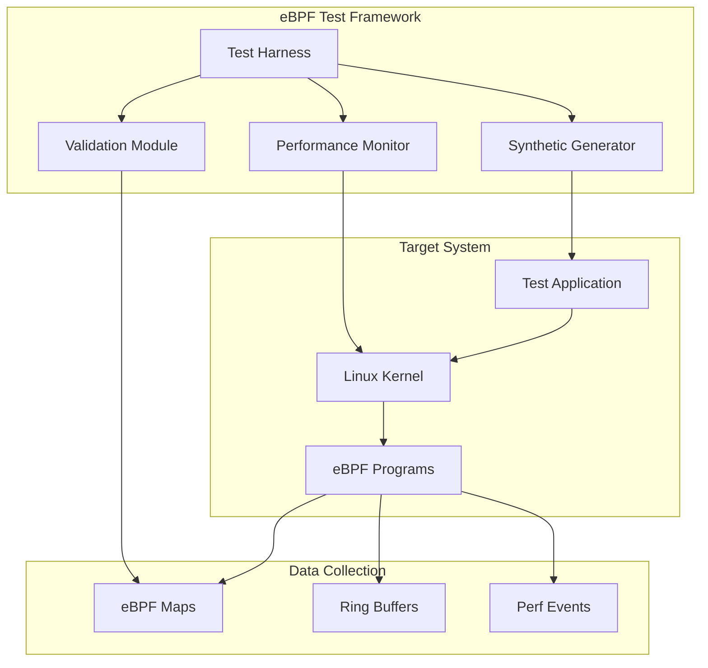

# eBPF Testing

DeepTrace's eBPF implementation requires comprehensive testing to ensure accurate data collection, minimal performance overhead, and compatibility across different kernel versions. This document covers the testing strategies, tools, and procedures for validating eBPF functionality.

## Overview

eBPF testing in DeepTrace focuses on:

- **Functionality Verification**: Ensuring accurate data capture from system calls
- **Performance Overhead**: Measuring impact on application performance
- **Kernel Compatibility**: Testing across different kernel versions
- **Data Integrity**: Validating captured trace data accuracy
- **Security**: Ensuring eBPF programs don't compromise system security

## Test Architecture



## Functionality Tests

### System Call Interception

Tests verify that eBPF programs correctly intercept and process system calls:

#### Network System Calls

```bash
cd tests/eBPF/functionality
python3 server.py &
python3 client.py
```

**Tested System Calls:**
- `read()` / `write()` - Socket I/O operations
- `sendmsg()` / `recvmsg()` - Message-based communication
- `sendmmsg()` / `recvmmsg()` - Batch message operations
- `sendto()` / `recvfrom()` - UDP communication
- `readv()` / `writev()` - Vectored I/O operations

### Data Validation

Data validation is performed by analyzing the collected trace data in Elasticsearch for correctness and completeness.

## Performance Overhead Tests

### Micro-benchmarks

Individual system call overhead measurement:

```bash
cd tests/eBPF/overhead
./run.sh write     # Test write() overhead
./run.sh read      # Test read() overhead
./run.sh sendmsg   # Test sendmsg() overhead
```

**Test Programs:**

1. **Write Test** (`src/write.c`):
   ```c
   // Measures write() system call overhead
   for (int i = 0; i < iterations; i++) {
       start = get_timestamp();
       write(fd, buffer, size);
       end = get_timestamp();
       record_latency(end - start);
   }
   ```

2. **SSL Test** (`src/ssl_write.c`):
   ```c
   // Measures SSL_write() overhead
   for (int i = 0; i < iterations; i++) {
       start = get_timestamp();
       SSL_write(ssl, buffer, size);
       end = get_timestamp();
       record_latency(end - start);
   }
   ```

### Application-Level Testing

Application-level performance testing uses the provided workload applications (BookInfo, Social Network) to measure real-world impact.

### Performance Metrics

**Latency Overhead:**
- Target: < 5% increase in system call latency
- Measurement: Nanosecond precision timing
- Statistical analysis: Mean, median, 95th/99th percentiles

**CPU Overhead:**
- Target: < 2% additional CPU usage
- Measurement: CPU utilization monitoring
- Analysis: Per-core usage and context switches

**Memory Overhead:**
- Target: < 10MB per eBPF program
- Measurement: Map memory usage and kernel memory
- Analysis: Memory growth over time

## Kernel Compatibility

DeepTrace requires Linux kernel 5.15+ for proper eBPF functionality. CO-RE (Compile Once, Run Everywhere) support is implemented for kernel compatibility.

## Data Integrity

Data integrity is validated by analyzing trace data collected in Elasticsearch, verifying:
- Correct span correlation
- Accurate payload capture
- Proper timestamp recording

## Security Considerations

eBPF programs in DeepTrace:
- Run with appropriate privileges
- Include proper memory access bounds checking
- Comply with eBPF verifier constraints
- Respect kernel resource limits

## Test Execution

Run eBPF tests using the provided scripts:

```bash
# Functionality tests
cd tests/eBPF/functionality
python3 server.py &
python3 client.py

# Performance overhead tests
cd tests/eBPF/overhead
bash run.sh write
bash run.sh read
bash run.sh sendto
```

## Debugging eBPF Programs

### Debug Tools

**bpftool**: Inspect loaded programs and maps
```bash
# List loaded programs
bpftool prog list

# Dump program instructions
bpftool prog dump xlated id 123

# Inspect map contents
bpftool map dump id 456
```

**bpftrace**: Dynamic tracing for debugging
```bash
# Trace eBPF program execution
bpftrace -e 'tracepoint:syscalls:sys_enter_read { @[comm] = count(); }'
```

### Verification Logs

Enable eBPF verifier logs for debugging:

```bash
# Enable verbose verifier output
echo 1 > /proc/sys/net/core/bpf_jit_enable
echo 2 > /proc/sys/kernel/bpf_stats_enabled

# Load program with debug info
./load_ebpf_program --debug --log-level 2
```

### Common Issues

1. **Verifier Rejection**
   ```bash
   # Check verifier logs
   dmesg | grep -i bpf
   # Common causes: unbounded loops, invalid memory access
   ```

2. **Map Access Errors**
   ```bash
   # Validate map definitions
   bpftool map show
   # Check key/value sizes and types
   ```

3. **Stack Overflow**
   ```bash
   # Monitor stack usage
   bpftrace -e 'kprobe:bpf_prog_run { @stack[kstack] = count(); }'
   ```


## Testing Best Practices

- Run tests in isolated environments
- Use actual workload applications for realistic testing
- Measure performance overhead with provided scripts
- Verify data correctness through Elasticsearch queries
