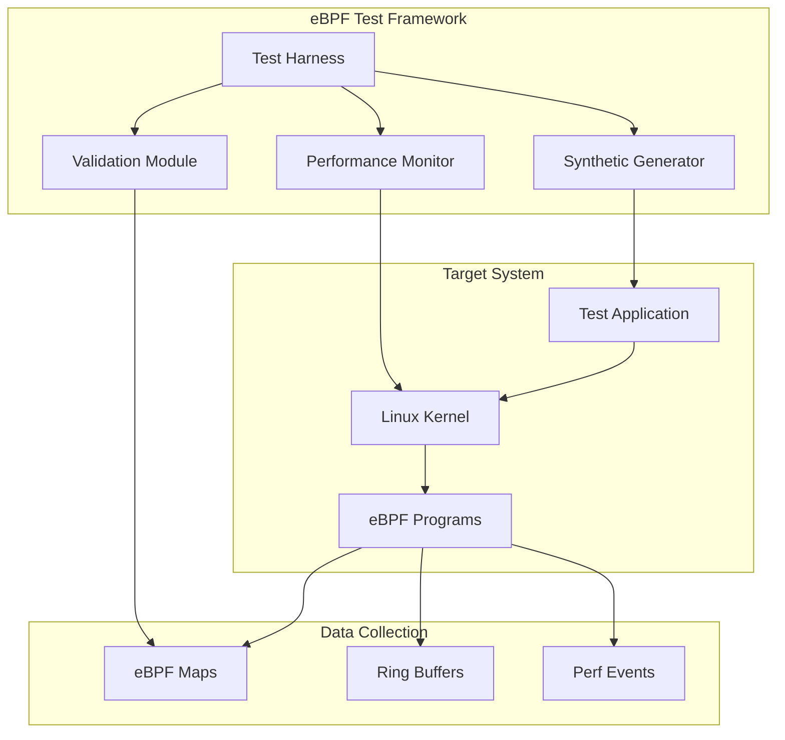

# eBPF Testing

DeepTrace's eBPF implementation requires comprehensive testing to ensure accurate data collection, minimal performance overhead, and compatibility across different kernel versions. This document covers the testing strategies, tools, and procedures for validating eBPF functionality.

## Overview

eBPF testing in DeepTrace focuses on:

- **Functionality Verification**: Ensuring accurate data capture from system calls
- **Performance Overhead**: Measuring impact on application performance
- **Kernel Compatibility**: Testing across different kernel versions
- **Data Integrity**: Validating captured trace data accuracy
- **Security**: Ensuring eBPF programs don't compromise system security

## Test Architecture



## Functionality Tests

### System Call Interception

Tests verify that eBPF programs correctly intercept and process system calls:

#### Network System Calls

```bash
cd tests/eBPF/functionality
./test_syscalls.sh network
```

**Tested System Calls:**
- `read()` / `write()` - Socket I/O operations
- `sendmsg()` / `recvmsg()` - Message-based communication
- `sendmmsg()` / `recvmmsg()` - Batch message operations
- `sendto()` / `recvfrom()` - UDP communication
- `readv()` / `writev()` - Vectored I/O operations

#### SSL/TLS Operations

```bash
cd tests/eBPF/functionality
./test_syscalls.sh ssl
```

**Tested Operations:**
- SSL_read() / SSL_write() - OpenSSL operations
- TLS handshake detection
- Certificate validation events
- Encrypted payload handling

### Data Structure Validation

Tests ensure eBPF data structures are correctly populated:

```rust
// Example test for Quintuple structure
#[test]
fn test_quintuple_extraction() {
    let test_data = generate_network_traffic();
    let quintuple = extract_quintuple(&test_data);
    
    assert_eq!(quintuple.src_ip, expected_src_ip);
    assert_eq!(quintuple.dst_ip, expected_dst_ip);
    assert_eq!(quintuple.src_port, expected_src_port);
    assert_eq!(quintuple.dst_port, expected_dst_port);
    assert_eq!(quintuple.protocol, expected_protocol);
}
```

### Memory Map Testing

Validates eBPF map operations and data consistency:

```bash
# Test map operations
./test_maps.sh --map-type hash --operations 10000
./test_maps.sh --map-type ringbuf --size 1MB
./test_maps.sh --map-type array --elements 1024
```

## Performance Overhead Tests

### Micro-benchmarks

Individual system call overhead measurement:

```bash
cd tests/eBPF/overhead
./run.sh write     # Test write() overhead
./run.sh read      # Test read() overhead
./run.sh sendmsg   # Test sendmsg() overhead
```

**Test Programs:**

1. **Write Test** (`src/write.c`):
   ```c
   // Measures write() system call overhead
   for (int i = 0; i < iterations; i++) {
       start = get_timestamp();
       write(fd, buffer, size);
       end = get_timestamp();
       record_latency(end - start);
   }
   ```

2. **SSL Test** (`src/ssl_write.c`):
   ```c
   // Measures SSL_write() overhead
   for (int i = 0; i < iterations; i++) {
       start = get_timestamp();
       SSL_write(ssl, buffer, size);
       end = get_timestamp();
       record_latency(end - start);
   }
   ```

### Macro-benchmarks

Application-level performance impact:

```bash
# HTTP server benchmark
./benchmark_http_server.sh --with-ebpf
./benchmark_http_server.sh --without-ebpf
./compare_results.sh

# Database benchmark
./benchmark_database.sh --workload oltp
./benchmark_database.sh --workload analytics
```

### Performance Metrics

**Latency Overhead:**
- Target: < 5% increase in system call latency
- Measurement: Nanosecond precision timing
- Statistical analysis: Mean, median, 95th/99th percentiles

**CPU Overhead:**
- Target: < 2% additional CPU usage
- Measurement: CPU utilization monitoring
- Analysis: Per-core usage and context switches

**Memory Overhead:**
- Target: < 10MB per eBPF program
- Measurement: Map memory usage and kernel memory
- Analysis: Memory growth over time

## Kernel Compatibility Tests

### Multi-Kernel Testing

Tests across different kernel versions:

```bash
# Test matrix
./test_kernel_compat.sh --kernel 5.4
./test_kernel_compat.sh --kernel 5.8
./test_kernel_compat.sh --kernel 5.15
./test_kernel_compat.sh --kernel 6.1
./test_kernel_compat.sh --kernel 6.8
```

### Feature Detection

Validates kernel feature availability:

```c
// Check for required eBPF features
bool check_kernel_features() {
    // Check for BPF_PROG_TYPE_TRACEPOINT
    if (!probe_prog_type(BPF_PROG_TYPE_TRACEPOINT)) {
        return false;
    }
    
    // Check for BPF_MAP_TYPE_RINGBUF
    if (!probe_map_type(BPF_MAP_TYPE_RINGBUF)) {
        return false;
    }
    
    // Check for BTF support
    if (!probe_btf_support()) {
        return false;
    }
    
    return true;
}
```

### CO-RE (Compile Once, Run Everywhere) Testing

Validates BTF-based relocations:

```bash
# Test CO-RE compatibility
./test_core.sh --target-kernel 5.4
./test_core.sh --target-kernel 6.8
./validate_relocations.sh
```

## Data Integrity Tests

### Trace Correlation

Validates span correlation across system boundaries:

```python
def test_trace_correlation():
    # Generate correlated network traffic
    client_span = generate_client_request()
    server_span = generate_server_response()
    
    # Validate correlation
    assert client_span.trace_id == server_span.trace_id
    assert server_span.parent_id == client_span.span_id
    assert server_span.start_time >= client_span.start_time
```

### Payload Validation

Ensures captured payloads match expected data:

```bash
# Test payload capture accuracy
./test_payload_capture.sh --protocol http
./test_payload_capture.sh --protocol grpc
./test_payload_capture.sh --protocol custom
```

### Timing Accuracy

Validates timestamp precision and consistency:

```c
// Test timestamp accuracy
void test_timestamp_accuracy() {
    uint64_t kernel_time = bpf_ktime_get_ns();
    uint64_t user_time = get_user_timestamp();
    uint64_t diff = abs(kernel_time - user_time);
    
    // Should be within 1ms
    assert(diff < 1000000);
}
```

## Security Tests

### Privilege Escalation

Ensures eBPF programs don't allow privilege escalation:

```bash
# Test as non-root user
sudo -u testuser ./test_ebpf_security.sh
```

### Memory Safety

Validates memory access bounds:

```c
// Test bounds checking
SEC("tracepoint/syscalls/sys_enter_read")
int trace_read_enter(struct trace_event_raw_sys_enter* ctx) {
    // Validate buffer bounds
    if (ctx->args[2] > MAX_BUFFER_SIZE) {
        return 0;  // Skip oversized reads
    }
    
    // Safe memory access
    char buffer[256];
    bpf_probe_read_user(buffer, sizeof(buffer), (void*)ctx->args[1]);
    
    return 0;
}
```

### Resource Limits

Tests eBPF program resource consumption:

```bash
# Test instruction limit
./test_instruction_limit.sh

# Test map size limits
./test_map_limits.sh --max-entries 1000000

# Test stack usage
./test_stack_usage.sh --max-stack 512
```

## Automated Testing

### Continuous Integration

eBPF tests in CI/CD pipeline:

```yaml
ebpf_tests:
  runs-on: ubuntu-latest
  strategy:
    matrix:
      kernel: [5.4, 5.8, 5.15, 6.1, 6.8]
  
  steps:
    - name: Setup Kernel
      run: |
        ./setup_kernel.sh ${{ matrix.kernel }}
        
    - name: Compile eBPF Programs
      run: |
        cd crates/ebpf-common
        cargo build --release
        
    - name: Run Functionality Tests
      run: |
        cd tests/eBPF/functionality
        ./run_all_tests.sh
        
    - name: Run Performance Tests
      run: |
        cd tests/eBPF/overhead
        ./run_performance_suite.sh
        
    - name: Validate Results
      run: |
        ./validate_test_results.sh --output junit.xml
```

### Test Automation Scripts

```bash
#!/bin/bash
# run_ebpf_tests.sh - Comprehensive eBPF test runner

set -euo pipefail

# Configuration
TEST_DURATION=300
ITERATIONS=1000
OUTPUT_DIR="./test-results/$(date +%Y%m%d-%H%M%S)"

mkdir -p "$OUTPUT_DIR"

echo "Starting eBPF test suite..."

# Functionality tests
echo "Running functionality tests..."
cd tests/eBPF/functionality
./run_all_tests.sh --output "$OUTPUT_DIR/functionality.json"

# Performance tests
echo "Running performance tests..."
cd ../overhead
./run_performance_suite.sh \
    --duration "$TEST_DURATION" \
    --iterations "$ITERATIONS" \
    --output "$OUTPUT_DIR/performance.json"

# Generate report
echo "Generating test report..."
python3 generate_ebpf_report.py \
    --input "$OUTPUT_DIR" \
    --output "$OUTPUT_DIR/report.html"

echo "eBPF tests completed. Results in: $OUTPUT_DIR"
```

## Debugging eBPF Programs

### Debug Tools

**bpftool**: Inspect loaded programs and maps
```bash
# List loaded programs
bpftool prog list

# Dump program instructions
bpftool prog dump xlated id 123

# Inspect map contents
bpftool map dump id 456
```

**bpftrace**: Dynamic tracing for debugging
```bash
# Trace eBPF program execution
bpftrace -e 'tracepoint:syscalls:sys_enter_read { @[comm] = count(); }'
```

### Verification Logs

Enable eBPF verifier logs for debugging:

```bash
# Enable verbose verifier output
echo 1 > /proc/sys/net/core/bpf_jit_enable
echo 2 > /proc/sys/kernel/bpf_stats_enabled

# Load program with debug info
./load_ebpf_program --debug --log-level 2
```

### Common Issues

1. **Verifier Rejection**
   ```bash
   # Check verifier logs
   dmesg | grep -i bpf
   # Common causes: unbounded loops, invalid memory access
   ```

2. **Map Access Errors**
   ```bash
   # Validate map definitions
   bpftool map show
   # Check key/value sizes and types
   ```

3. **Stack Overflow**
   ```bash
   # Monitor stack usage
   bpftrace -e 'kprobe:bpf_prog_run { @stack[kstack] = count(); }'
   ```

## Performance Regression Testing

### Baseline Establishment

```bash
# Establish performance baseline
./establish_baseline.sh --workload http_server --duration 600
./establish_baseline.sh --workload database --duration 600
```

### Regression Detection

```python
def detect_performance_regression(baseline, current):
    """Detect performance regressions in eBPF overhead."""
    
    threshold = 0.05  # 5% regression threshold
    
    for metric in ['latency_p95', 'cpu_usage', 'memory_usage']:
        baseline_value = baseline[metric]
        current_value = current[metric]
        
        regression = (current_value - baseline_value) / baseline_value
        
        if regression > threshold:
            raise PerformanceRegressionError(
                f"{metric} regression: {regression:.2%}"
            )
```

### Automated Alerts

```bash
# Performance monitoring script
#!/bin/bash
BASELINE_FILE="baseline_performance.json"
CURRENT_RESULTS="current_performance.json"

if python3 check_regression.py \
    --baseline "$BASELINE_FILE" \
    --current "$CURRENT_RESULTS"; then
    echo "Performance tests passed"
else
    echo "Performance regression detected!"
    # Send alert to monitoring system
    curl -X POST "$ALERT_WEBHOOK" \
        -d '{"text": "eBPF performance regression detected"}'
    exit 1
fi
```

## Best Practices

### Test Development

- **Isolation**: Run tests in isolated environments
- **Reproducibility**: Use fixed seeds for random data generation
- **Coverage**: Test both success and failure scenarios
- **Documentation**: Document test objectives and expected outcomes

### Performance Testing

- **Warm-up**: Allow system warm-up before measurements
- **Multiple Runs**: Execute multiple test iterations
- **Statistical Analysis**: Use proper statistical methods
- **Environment Control**: Control for external factors

### Security Testing

- **Least Privilege**: Test with minimal required permissions
- **Input Validation**: Test with malformed inputs
- **Resource Limits**: Verify resource consumption bounds
- **Audit Trails**: Maintain logs of security test results
