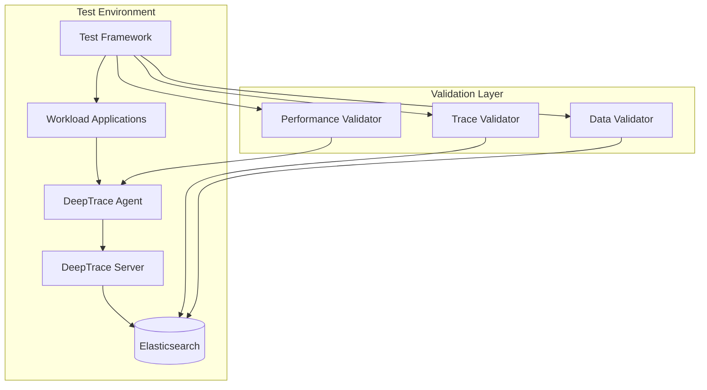

# Integration Tests

DeepTrace provides comprehensive integration tests to validate the entire system's functionality across different deployment scenarios and workloads. These tests ensure that all components work together correctly and that the distributed tracing data is accurately captured and processed.

## Overview

Integration tests in DeepTrace cover:

- **End-to-End Tracing**: Validating complete trace flows from application to storage
- **Multi-Service Communication**: Testing trace correlation across microservices
- **Protocol Support**: Verifying HTTP, gRPC, and custom protocol tracing
- **Data Integrity**: Ensuring trace data accuracy and completeness
- **Performance Validation**: Confirming system performance under load

## Test Architecture



## ProcFS Integration Tests

DeepTrace includes specialized ProcFS integration tests that validate the accuracy of system metric collection modules.

### Features

- **Synthetic Data Generation**: Creates realistic procfs data with configurable value ranges
- **Multi-Module Coverage**: Tests CPU, memory, virtual memory, disk, and network metrics
- **Fuzzy Validation**: Uses relative error tolerance for floating-point comparisons
- **Process Isolation**: Independent test processes prevent static variable conflicts
- **Timestamped Sessions**: Organized output with `YYYYMMDD-HHMMSS` directory structure

### Test Structure

```
tests/procfs-integration-tests/
├── src/
│   ├── main.rs              # Test orchestration and CLI
│   ├── run.rs               # Individual test execution
│   └── validators.rs        # Metric validation logic
└── Cargo.toml
```

### Running ProcFS Tests

```bash
cd tests/procfs-integration-tests
cargo run -- --tests 100 --output ./test-results
```

### Generated Test Data

The framework generates synthetic procfs data for:

- **CPU Statistics** (`/proc/stat`): User, system, idle, and I/O wait times
- **Memory Information** (`/proc/meminfo`): Total, free, available, and cached memory
- **Virtual Memory Stats** (`/proc/vmstat`): Page faults, swapping, and memory allocation
- **Disk Statistics** (`/proc/diskstats`): Read/write operations, sectors, and timing
- **Network Interfaces** (`/proc/net/dev`): Bytes, packets, errors, and drops

## Workload Integration Tests

DeepTrace supports multiple workload applications for comprehensive testing:

### BookInfo Microservices

A simple microservices application based on Istio's BookInfo example.

**Architecture:**
- **Product Page**: Frontend service
- **Details**: Book details service
- **Reviews**: Book reviews service (with ratings integration)
- **Ratings**: Book ratings service

**Running BookInfo Tests:**

```bash
cd tests/workload/bookinfo
sudo bash deploy.sh     # Deploy services
sudo bash client.sh     # Generate traffic
sudo bash clear.sh      # Cleanup
```

### Social Network Microservices

A complex social network application with multiple interconnected services.

**Features:**
- Create and read text posts
- User timeline management
- Follow/unfollow relationships
- User recommendations
- Search functionality
- User authentication

**Services:**
- Frontend services (Nginx, Media Frontend)
- Core services (User, Post, Timeline, Social Graph)
- Data stores (MongoDB, Redis, Memcached)
- External integrations (URL shortener, Media storage)

**Running Social Network Tests:**

```bash
cd tests/workload/socialnetwork
bash deploy.sh          # Deploy full stack
bash client.sh          # Generate synthetic load
bash clear.sh           # Cleanup resources
```

## Test Execution Framework

### Test Categories

1. **Functional Tests**
   - Trace data accuracy
   - Service discovery
   - Protocol parsing
   - Error handling

2. **Performance Tests**
   - Latency overhead
   - Throughput impact
   - Memory usage
   - CPU utilization

3. **Scalability Tests**
   - Multi-host deployment
   - High-volume traffic
   - Concurrent connections
   - Resource scaling

### Test Execution

```bash
# Run all integration tests
cd tests
python3 test_runner.py --suite integration

# Run specific workload tests
python3 test_runner.py --workload bookinfo
python3 test_runner.py --workload socialnetwork

# Run performance validation
python3 test_runner.py --suite performance --duration 300
```

## Validation Criteria

### Trace Completeness

- **Span Coverage**: All expected spans are captured
- **Timing Accuracy**: Timestamps are within acceptable ranges
- **Correlation**: Parent-child relationships are correct
- **Metadata**: Service names, operations, and tags are accurate

### Performance Thresholds

- **Latency Overhead**: < 5% increase in application latency
- **CPU Overhead**: < 10% additional CPU usage
- **Memory Overhead**: < 50MB per agent instance
- **Network Overhead**: < 1% of application traffic

### Data Integrity

- **No Data Loss**: All generated spans are stored
- **Consistent Timestamps**: Monotonic time progression
- **Accurate Durations**: Span durations match actual execution time
- **Proper Encoding**: All data is correctly serialized/deserialized

## Continuous Integration

Integration tests are automatically executed in CI/CD pipelines:

```yaml
# Example CI configuration
integration_tests:
  runs-on: ubuntu-latest
  steps:
    - name: Setup Test Environment
      run: |
        docker-compose -f docker-compose.test.yml up -d
        
    - name: Run Integration Tests
      run: |
        cd tests
        python3 test_runner.py --suite integration --output junit.xml
        
    - name: Validate Results
      run: |
        python3 validate_traces.py --elasticsearch http://localhost:9200
        
    - name: Cleanup
      run: |
        docker-compose -f docker-compose.test.yml down
```

## Troubleshooting Integration Tests

### Common Issues

1. **Service Startup Delays**
   ```bash
   # Add health checks and wait conditions
   docker-compose up -d
   ./wait-for-services.sh
   ```

2. **Port Conflicts**
   ```bash
   # Check for conflicting services
   netstat -tulpn | grep :9200
   docker ps | grep elasticsearch
   ```

3. **Insufficient Resources**
   ```bash
   # Monitor resource usage
   docker stats
   free -h
   df -h
   ```

4. **Network Connectivity**
   ```bash
   # Test service connectivity
   curl -f http://localhost:9200/_cluster/health
   curl -f http://localhost:8080/health
   ```

### Debug Mode

Enable debug logging for detailed test execution information:

```bash
export DEEPTRACE_LOG_LEVEL=debug
export RUST_LOG=debug
python3 test_runner.py --suite integration --debug
```

## Test Results Analysis

### Metrics Collection

Integration tests collect comprehensive metrics:

- **Trace Metrics**: Span count, duration distribution, error rates
- **System Metrics**: CPU, memory, network, disk usage
- **Application Metrics**: Request latency, throughput, error rates

### Report Generation

```bash
# Generate comprehensive test report
python3 generate_report.py --input test-results/ --output report.html

# Export metrics to monitoring systems
python3 export_metrics.py --prometheus http://localhost:9090
```

### Performance Regression Detection

Automated performance regression detection compares results against baseline:

```bash
# Set performance baseline
python3 set_baseline.py --results current-results/

# Compare against baseline
python3 compare_performance.py --baseline baseline/ --current current-results/
```

## Best Practices

### Test Environment

- Use consistent hardware configurations
- Isolate test environments from production
- Reset state between test runs
- Monitor resource usage during tests

### Test Data

- Use realistic data volumes
- Include edge cases and error scenarios
- Validate data cleanup after tests
- Maintain test data versioning

### Result Validation

- Set appropriate timeout values
- Use statistical analysis for performance metrics
- Implement retry mechanisms for flaky tests
- Archive test results for historical analysis
