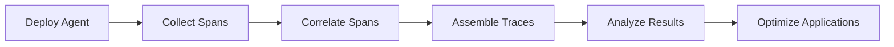

# Basic Usage

This guide covers the essential operations and workflows for using DeepTrace effectively. After completing the installation and initial setup, follow these instructions to start collecting and analyzing distributed traces.

## Prerequisites

Before using DeepTrace, ensure you have:

- ✅ **Completed installation** ([Installation Guide](../getting-started/installation.md))
- ✅ **Configured the system** ([Configuration Guide](../getting-started/configuration.md))
- ✅ **Deployed server and agent** ([All-in-One Guide](../getting-started/all-in-one.md))
- ✅ **Running applications** to trace

## Core Workflow

DeepTrace follows a standard workflow for distributed tracing:



## 1. Agent Management

### Starting the Agent

```bash
# Start the agent on target hosts
sudo docker exec -it deeptrace_server python -m cli.src.cmd agent run
```

### Checking Agent Status

```bash
# Verify agent is running
curl http://localhost:7899/status

# Check agent health
sudo docker exec -it deeptrace_server python -m cli.src.cmd agent status
```

### Stopping the Agent

```bash
# Stop the agent gracefully
sudo docker exec -it deeptrace_server python -m cli.src.cmd agent stop
```

## 2. Span Collection

### Automatic Collection

By default, DeepTrace automatically collects spans from all Docker containers:

```bash
# View real-time span collection
sudo docker exec -it deeptrace_server tail -f /var/log/deeptrace/agent.log
```

### Manual Process Selection

Configure specific processes to monitor:

```toml
# In deeptrace.toml
[agents.trace]
# Monitor specific PIDs
pids = [1234, 5678, 9012]

# Or monitor by process name
include_processes = ["nginx", "redis-server", "app-server"]
exclude_processes = ["systemd", "kernel"]
```

### Span Filtering

Filter spans by various criteria:

```bash
# Filter by service name
curl "http://localhost:7899/spans?service=user-service"

# Filter by time range
curl "http://localhost:7899/spans?start=2024-01-01T00:00:00Z&end=2024-01-02T00:00:00Z"

# Filter by operation
curl "http://localhost:7899/spans?operation=GET /api/users"
```

## 3. Span Correlation

### Available Algorithms

DeepTrace supports multiple correlation algorithms:

| Algorithm | Description | Use Case |
|-----------|-------------|----------|
| `deeptrace` | Advanced transaction-based correlation | **Recommended** for production |
| `fifo` | Simple first-in-first-out correlation | Basic testing |
| `vpath` | Virtual path-based correlation | Legacy systems |
| `wap5` | WAP5 algorithm | Research comparison |
| `traceweaver_v1` | TraceWeaver v1 algorithm | Academic benchmarking |
| `deepflow` | DeepFlow algorithm | Performance comparison |

### Running Correlation

```bash
# Use DeepTrace algorithm (recommended)
sudo docker exec -it deeptrace_server python -m cli.src.cmd asso algo deeptrace

# Use alternative algorithms for comparison
sudo docker exec -it deeptrace_server python -m cli.src.cmd asso algo fifo
```

### Correlation Configuration

Fine-tune correlation parameters:

```bash
# Set correlation window (milliseconds)
sudo docker exec -it deeptrace_server python -m cli.src.cmd asso config --window 1000

# Set similarity threshold
sudo docker exec -it deeptrace_server python -m cli.src.cmd asso config --threshold 0.8

# Enable debug mode
sudo docker exec -it deeptrace_server python -m cli.src.cmd asso config --debug
```

## 4. Trace Assembly

### Basic Assembly

```bash
# Assemble traces from correlated spans
sudo docker exec -it deeptrace_server python -m cli.src.cmd assemble
```

### Advanced Assembly Options

```bash
# Assemble with specific parameters
sudo docker exec -it deeptrace_server python -m cli.src.cmd assemble \
  --max-depth 10 \
  --timeout 30 \
  --min-spans 2
```

### Batch Processing

```bash
# Process traces in batches
sudo docker exec -it deeptrace_server python -m cli.src.cmd assemble \
  --batch-size 1000 \
  --parallel 4
```

## 5. Data Analysis

### Web Interface Access

Access the Kibana dashboard for trace analysis:

```
URL: http://YOUR_SERVER_IP:5601
Username: elastic
Password: YOUR_ELASTIC_PASSWORD
```

### Basic Queries

#### View Recent Traces

1. Navigate to **Discover** in Kibana
2. Select the trace index pattern
3. Set time range to "Last 1 hour"
4. View collected traces

#### Search by Service

```
service.name: "user-service"
```

#### Search by Operation

```
operation.name: "GET /api/users"
```

#### Search by Duration

```
duration: >1000  # Traces longer than 1 second
```

### Advanced Analysis

#### Trace Topology

```bash
# Generate service dependency graph
sudo docker exec -it deeptrace_server python -m cli.src.cmd analyze topology

# Export topology to file
sudo docker exec -it deeptrace_server python -m cli.src.cmd analyze topology --output topology.json
```

#### Performance Analysis

```bash
# Analyze latency patterns
sudo docker exec -it deeptrace_server python -m cli.src.cmd analyze latency

# Generate performance report
sudo docker exec -it deeptrace_server python -m cli.src.cmd analyze performance --report
```

#### Error Analysis

```bash
# Find error patterns
sudo docker exec -it deeptrace_server python -m cli.src.cmd analyze errors

# Generate error report
sudo docker exec -it deeptrace_server python -m cli.src.cmd analyze errors --detailed
```

## 6. Common Operations

### Monitoring System Health

#### Check Component Status

```bash
# Server health
curl http://localhost:7901/health

# Elasticsearch health
curl http://localhost:9200/_cluster/health

# Agent health
curl http://localhost:7899/health
```

#### Monitor Resource Usage

```bash
# Container resource usage
sudo docker stats

# System resource usage
htop
iotop
```

### Data Management

#### Export Traces

```bash
# Export traces to JSON
sudo docker exec -it deeptrace_server python -m cli.src.cmd export \
  --format json \
  --output traces.json \
  --start "2024-01-01T00:00:00Z" \
  --end "2024-01-02T00:00:00Z"
```

#### Clean Old Data

```bash
# Clean traces older than 7 days
sudo docker exec -it deeptrace_server python -m cli.src.cmd cleanup --days 7

# Clean by index pattern
curl -X DELETE "localhost:9200/traces-2024.01.*"
```

#### Backup Data

```bash
# Create Elasticsearch snapshot
curl -X PUT "localhost:9200/_snapshot/backup/snapshot_1" -H 'Content-Type: application/json' -d'
{
  "indices": "traces-*",
  "ignore_unavailable": true,
  "include_global_state": false
}'
```

### Configuration Updates

#### Runtime Configuration Changes

```bash
# Update agent configuration
sudo docker exec -it deeptrace_server python -m cli.src.cmd config update \
  --key "agents.trace.batch_size" \
  --value 2048

# Reload configuration
sudo docker exec -it deeptrace_server python -m cli.src.cmd config reload
```

#### Dynamic Process Filtering

```bash
# Add process to monitoring
sudo docker exec -it deeptrace_server python -m cli.src.cmd agent add-process --pid 12345

# Remove process from monitoring
sudo docker exec -it deeptrace_server python -m cli.src.cmd agent remove-process --pid 12345
```

## 7. Troubleshooting Common Issues

### No Traces Collected

**Check Agent Status**:
```bash
curl http://localhost:7899/status
```

**Verify Process Filtering**:
```bash
# Check monitored processes
sudo docker exec -it deeptrace_server python -m cli.src.cmd agent list-processes
```

**Check eBPF Programs**:
```bash
# Verify eBPF programs are loaded
sudo bpftool prog list | grep deeptrace
```

### Poor Correlation Results

**Adjust Algorithm Parameters**:
```bash
# Increase correlation window
sudo docker exec -it deeptrace_server python -m cli.src.cmd asso config --window 2000

# Lower similarity threshold
sudo docker exec -it deeptrace_server python -m cli.src.cmd asso config --threshold 0.6
```

**Try Different Algorithm**:
```bash
# Switch to FIFO for comparison
sudo docker exec -it deeptrace_server python -m cli.src.cmd asso algo fifo
```

### High Resource Usage

**Reduce Payload Capture**:
```toml
[agents.capture]
max_payload_size = 512
enable_compression = true
```

**Implement Sampling**:
```toml
[agents.trace]
sampling_rate = 0.1  # Sample 10% of requests
```

### Data Loss

**Check Ring Buffer Size**:
```bash
# Monitor buffer utilization
sudo bpftool map show | grep ringbuf
```

**Increase Buffer Capacity**:
```toml
[agents.sender]
mem_buffer_size = 64  # Increase from default 16MB
batch_size = 2048     # Increase batch size
```

## 8. Best Practices

### Performance Optimization

1. **Start Small**: Begin with a subset of services
2. **Monitor Impact**: Track application performance metrics
3. **Tune Gradually**: Adjust configuration based on observations
4. **Use Sampling**: Implement sampling for high-traffic services

### Data Quality

1. **Validate Traces**: Regularly check trace completeness
2. **Monitor Correlation**: Track correlation accuracy metrics
3. **Clean Data**: Implement data retention policies
4. **Backup Regularly**: Maintain data backups

### Operational Excellence

1. **Automate Deployment**: Use infrastructure as code
2. **Monitor Health**: Set up alerting for component failures
3. **Document Changes**: Track configuration modifications
4. **Plan Capacity**: Monitor resource usage trends

## Next Steps

After mastering basic usage:

- **[Deployment Modes](./deployment-modes.md)**: Learn about distributed deployment
- **[Trace Analysis](./trace-analysis.md)**: Advanced analysis techniques
- **[Web Interface](./web-interface.md)**: Detailed dashboard usage
- **[Performance Tuning](../advanced/performance-tuning.md)**: Optimize for your workload

---

This basic usage guide provides the foundation for effective DeepTrace operation. As you become more familiar with the system, explore the advanced features and optimization techniques covered in other sections of this documentation.
