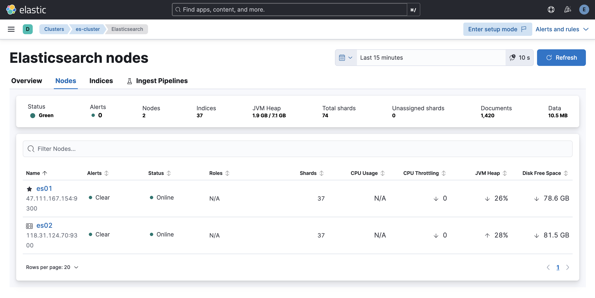

# Database

This document aims to guide users through the installation and testing of a multi-node Docker-based Elasticsearch database cluster. It provides detailed steps for setting up the cluster and verifying its functionality.

## Elastic Multi-Node Docker Installation Guide

### Core Conclusion
This guide demonstrates the deployment of a multi-node Elasticsearch cluster (including Kibana) using Docker. By splitting configuration files, synchronizing certificates, and setting environment variables, cross-node deployment is achieved, resulting in a healthy and functional cluster environment.

### 1. Environment Preparation
- **Basic Requirements**:  
  - Docker: 24.0.7+  
  - Docker Compose: v2.21.0+  
  - Operating System: Linux/amd64

- **Image Details**:  
  - Elasticsearch: 8.15.2  
  - Kibana: 8.15.2

- **Node Planning**:  
  At least two nodes are required. In this example, we use two nodes:  
  - Node 1: IP address `ip1`, hosting Elasticsearch instance `es01` and Kibana.  
  - Node 2: IP address `ip2`, hosting Elasticsearch instance `es02`.

### 2. Pre-Deployment Preparation

#### 1. Directory and Permission Configuration (All Nodes)
- **Create Mount Directories by Node Role**:  
  - Node 1: Create `/opt/data/{es01,kibana}`  
  - Node 2: Create `/opt/data/es02`
- **Set Directory Permissions**:  
  Execute the following command to set permissions, ensuring compatibility with the non-root user (ID 1000) inside the container:
  ```bash
  chown -R 1000:1000 /opt/data/<directory>
  ```

#### 2. Configuration File Preparation (Node 1 First)
- **Create `.env` File**:  
  Define core parameters such as Elastic and Kibana passwords, cluster name, version, ports, and memory limits. Below is an example:
  ```env
  # Password for the 'elastic' user (at least 6 characters)
  ELASTIC_PASSWORD=1qazXSW@

  # Password for the 'kibana_system' user (at least 6 characters)
  KIBANA_PASSWORD=1qazXSW@

  # Version of Elastic products
  STACK_VERSION=8.15.2

  # Set the cluster name
  CLUSTER_NAME=es-cluster

  # Set to 'basic' or 'trial' to automatically start the 30-day trial
  LICENSE=basic
  #LICENSE=trial

  # Port to expose Elasticsearch HTTP API to the host
  ES_PORT=9200
  #ES_PORT=127.0.0.1:9200

  # Port to expose Kibana to the host
  KIBANA_PORT=5601
  #KIBANA_PORT=80

  # Increase or decrease based on the available host memory (in bytes)
  MEM_LIMIT=17179869184

  # Project namespace (defaults to the current folder name if not set)
  #COMPOSE_PROJECT_NAME=myproject
  ```

- **Create `docker-compose.yaml` File**:  
  Include the following services:
  - `setup`: For certificate generation.  
  - `es01`: Elasticsearch instance.  
  - `kibana`: Kibana instance.  
  Configure mount directories, environment variables, and network modes as needed. Below is an example:
  ```yaml
  version: "3"

  services:
    setup:
      image: docker.elastic.co/elasticsearch/elasticsearch:${STACK_VERSION}
      volumes:
        - ./certs:/usr/share/elasticsearch/config/certs
      user: "0"
      command: >
        bash -c '
          if [ x${ELASTIC_PASSWORD} == x ]; then
            echo "Set the ELASTIC_PASSWORD environment variable in the .env file";
            exit 1;
          elif [ x${KIBANA_PASSWORD} == x ]; then
            echo "Set the KIBANA_PASSWORD environment variable in the .env file";
            exit 1;
          fi;
          if [ ! -f config/certs/ca.zip ]; then
            echo "Creating CA";
            bin/elasticsearch-certutil ca --silent --pem -out config/certs/ca.zip;
            unzip config/certs/ca.zip -d config/certs;
          fi;
          if [ ! -f config/certs/certs.zip ]; then
            echo "Creating certs";
            echo -ne \
            "instances:\n"\
            "  - name: es01\n"\
            "    dns:\n"\
            "      - es01\n"\
            "    ip:\n"\
            "      - ip1\n"\
            "  - name: es02\n"\
            "    dns:\n"\
            "      - es02\n"\
            "    ip:\n"\
            "      - ip2\n"\
            > config/certs/instances.yml;
            bin/elasticsearch-certutil cert --silent --pem -out config/certs/certs.zip --in config/certs/instances.yml --ca-cert config/certs/ca/ca.crt --ca-key config/certs/ca/ca.key;
            unzip config/certs/certs.zip -d config/certs;
          fi;
          echo "Setting file permissions"
          chown -R root:root config/certs;
          find . -type d -exec chmod 750 \{\} \;;
          find . -type f -exec chmod 640 \{\} \;;
          echo "Waiting for Elasticsearch availability";
          until curl -s --cacert config/certs/ca/ca.crt https://ip1:9200 | grep -q "missing authentication credentials"; do sleep 30; done;
          echo "Setting kibana_system password";
          until curl -s -X POST --cacert config/certs/ca/ca.crt -u "elastic:${ELASTIC_PASSWORD}" -H "Content-Type: application/json" https://ip1:9200/_security/user/kibana_system/_password -d "{\"password\":\"${KIBANA_PASSWORD}\"}" | grep -q "^{}"; do sleep 10; done;
          echo "All done!";
        '
      healthcheck:
        test: ["CMD-SHELL", "[ -f config/certs/es01/es01.crt ]"]
        interval: 1s
        timeout: 5s
        retries: 120

    es01:
      depends_on:
        setup:
          condition: service_healthy
      image: docker.elastic.co/elasticsearch/elasticsearch:${STACK_VERSION}
      volumes:
        - ./certs:/usr/share/elasticsearch/config/certs
        - /opt/data/es01:/usr/share/elasticsearch/data
      environment:
        - node.name=es01
        - cluster.name=${CLUSTER_NAME}
        - cluster.initial_master_nodes=es01,es02
        - discovery.seed_hosts=ip2
        - ELASTIC_PASSWORD=${ELASTIC_PASSWORD}
        - bootstrap.memory_lock=true
        - xpack.security.enabled=true
        - xpack.security.http.ssl.enabled=true
        - xpack.security.http.ssl.key=certs/es01/es01.key
        - xpack.security.http.ssl.certificate=certs/es01/es01.crt
        - xpack.security.http.ssl.certificate_authorities=certs/ca/ca.crt
        - xpack.security.transport.ssl.enabled=true
        - xpack.security.transport.ssl.key=certs/es01/es01.key
        - xpack.security.transport.ssl.certificate=certs/es01/es01.crt
        - xpack.security.transport.ssl.certificate_authorities=certs/ca/ca.crt
        - xpack.security.transport.ssl.verification_mode=certificate
        - xpack.license.self_generated.type=${LICENSE}
      restart: always
      network_mode: host
      ulimits:
        memlock:
          soft: -1
          hard: -1
      healthcheck:
        test:
          [
            "CMD-SHELL",
            "curl -s -k --cacert config/certs/ca/ca.crt https://localhost:9200 | grep -q 'missing authentication credentials'",
          ]
        interval: 10s
        timeout: 10s
        retries: 120

    kibana:
      depends_on:
        es01:
          condition: service_healthy
      image: docker.elastic.co/kibana/kibana:${STACK_VERSION}
      volumes:
        - ./certs:/usr/share/kibana/config/certs
        - /opt/data/kibana:/usr/share/kibana/data
      environment:
        - SERVERNAME=kibana
        - ELASTICSEARCH_HOSTS=https://ip1:9200
        - ELASTICSEARCH_USERNAME=kibana_system
        - ELASTICSEARCH_PASSWORD=${KIBANA_PASSWORD}
        - ELASTICSEARCH_SSL_CERTIFICATEAUTHORITIES=config/certs/ca/ca.crt
      restart: always
      network_mode: host
      healthcheck:
        test:
          [
            "CMD-SHELL",
            "curl -k -s -I http://localhost:5601 | grep -q 'HTTP/1.1 302 Found'",
          ]
        interval: 10s
        timeout: 10s
        retries: 120
  ```

### 3. Cluster Deployment Steps

#### 1. Start `es01` Node and Kibana
- Navigate to the configuration directory on the `es01` node and start the services:
  ```bash
  docker compose up -d
  ```
- Wait for the health checks to pass. You can verify the status using:
  ```bash
  docker compose ps
  ```
  Ensure the status shows `Healthy` or `Started`.

#### 2. Synchronize Configuration Files to Other Nodes
- On the `es01` node, execute the following command to synchronize the certificate directory and `.env` file to the target node:
  ```bash
  scp -r certs/ .env target-node:/opt/compose/es/
  ```

#### 3. Deploy `es02` Node
- On the `es02` node, create a dedicated `docker-compose.yaml` file. Retain only the configuration for the corresponding `es` service, adapting parameters such as node name and discovery nodes. Below is an example:
  ```yaml
  version: '3'
  services:
    es02:
      image: docker.elastic.co/elasticsearch/elasticsearch:${STACK_VERSION}
      volumes:
        - ./certs:/usr/share/elasticsearch/config/certs
        - /opt/data/es02/:/usr/share/elasticsearch/data
      environment:
        - node.name=es02
        - cluster.name=${CLUSTER_NAME}
        - cluster.initial_master_nodes=es01,es02
        - discovery.seed_hosts=ip1
        - bootstrap.memory_lock=true
        - xpack.security.enabled=true
        - xpack.security.http.ssl.enabled=true
        - xpack.security.http.ssl.key=certs/es02/es02.key
        - xpack.security.http.ssl.certificate=certs/es02/es02.crt
        - xpack.security.http.ssl.certificate_authorities=certs/ca/ca.crt
        - xpack.security.transport.ssl.enabled=true
        - xpack.security.transport.ssl.key=certs/es02/es02.key
        - xpack.security.transport.ssl.certificate=certs/es02/es02.crt
        - xpack.security.transport.ssl.certificate_authorities=certs/ca/ca.crt
        - xpack.security.transport.ssl.verification_mode=certificate
        - xpack.license.self_generated.type=${LICENSE}
      restart: always
      network_mode: host
      ulimits:
        memlock:
          soft: -1
          hard: -1
      healthcheck:
        test:
          [
            "CMD-SHELL",
            "curl -s -k --cacert config/certs/ca/ca.crt https://localhost:9200 | grep -q 'missing authentication credentials'",
          ]
        interval: 10s
        timeout: 10s
        retries: 120
  ```
- Start the service on the `es02` node:
  ```bash
  docker compose up -d
  ```
- Wait for the health checks to pass. Ensure the status changes to `Healthy`.

### 4. Cluster Verification

#### 1. Verify Cluster Nodes
- Execute the following command to check if all nodes have successfully joined the cluster:
  ```bash
  curl --user "elastic:<password>" -k https://<es01-node-IP>:9200/_cat/nodes?v
  ```

#### 2. Check Cluster Health
- Run the following command to confirm the cluster status is `green` (healthy):
  ```bash
  curl --user "elastic:<password>" -k https://<es01-node-IP>:9200/_cat/health?v
  ```

#### 3. Access Kibana
- Open a browser and navigate to:
  ```
  http://<es01-node-IP>:5601
  ```
- Log in using the `elastic` username and password to verify the availability of the Kibana visualization interface.



#### 4. Client Read/Write Data Test
Below is an example Python script to test data read/write operations:
```python
from elasticsearch import Elasticsearch
import ssl
import random
import time
import requests
requests.packages.urllib3.disable_warnings()

# Elasticsearch configuration
HOST = "https://ip1:9200"  # Elasticsearch address
USER = "elastic"  # Username
PASSWORD = "xxx"  # Password

def create_client():
    """
    Create an Elasticsearch client using self-signed certificates.
    """
    try:
        # Create Elasticsearch client
        client = Elasticsearch(
            hosts=[HOST],
            basic_auth=(USER, PASSWORD),
            verify_certs=False
        )
        print("Elasticsearch client created")
        return client
    except Exception as e:
        print(f"Error creating Elasticsearch client: {e}")
        raise

def main():
    client = create_client()

    # Test connection
    try:
        print("Testing connection...")
        if client.ping():
            print("Successfully connected to Elasticsearch!")
        else:
            print("Failed to connect to Elasticsearch!")
            return
    except Exception as e:
        print(f"Error connecting to Elasticsearch: {e}")
        return

    # Example: Create index
    index_name = "test-index"
    try:
        if not client.indices.exists(index=index_name):
            client.indices.create(index=index_name)
            print(f"Index {index_name} created")
    except Exception as e:
        print(f"Error creating index: {e}")
        return

    # Example: Randomly write 10 documents
    print("Writing data...")
    for i in range(10):
        doc = {
            "id": i,
            "message": f"Random message {i}",
            "value": random.randint(1, 100),
            "timestamp": time.strftime("%Y-%m-%dT%H:%M:%S")
        }
        try:
            response = client.index(index=index_name, document=doc)
            print(f"Document written, ID: {response['_id']}")
        except Exception as e:
            print(f"Error writing document: {e}")

    # Example: Read 10 documents
    print("Reading data...")
    try:
        response = client.search(index=index_name, query={"match_all": {}}, size=10)
        print(f"Search results: {len(response['hits']['hits'])} documents")
        for hit in response['hits']['hits']:
            print(hit['_source'])
    except Exception as e:
        print(f"Error reading documents: {e}")

if __name__ == "__main__":
    main()
```
