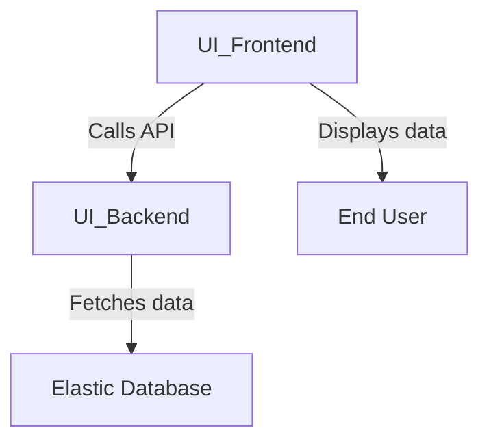
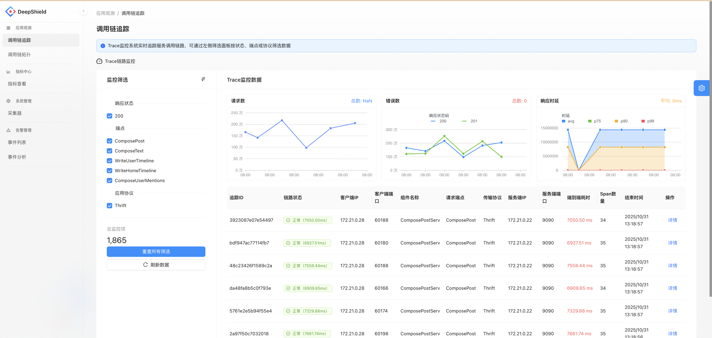
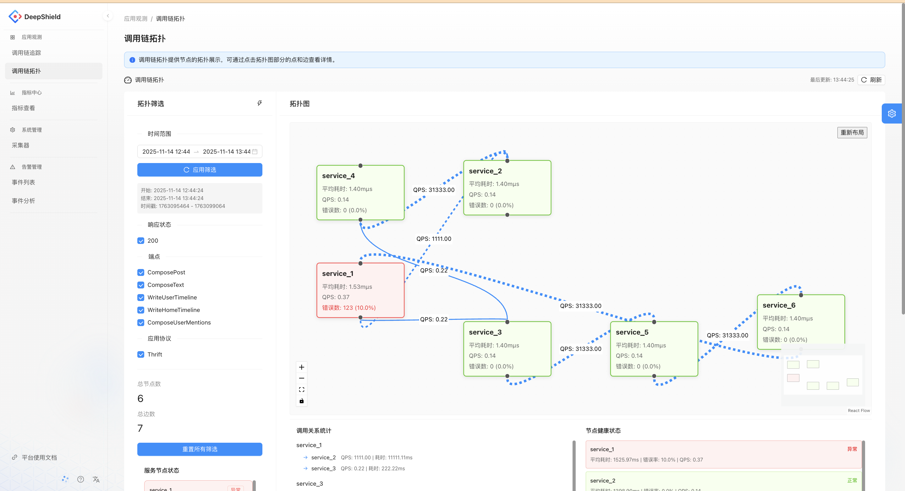
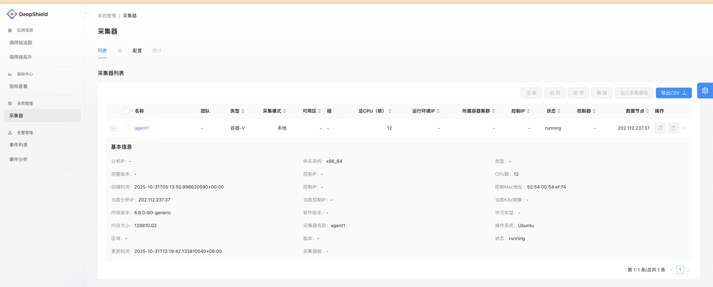

# Web Interface

The DeepTrace web interface provides an intuitive user experience, enabling users to interact with the system effortlessly. Through the collaboration of the frontend, backend, and database, the system efficiently processes data and delivers real-time feedback.

## UI Architecture


### Component Descriptions

1. **UI Frontend**  
   The `UI_Frontend` is the user-facing component of the system. It is responsible for rendering the interface and interacting with the user. The frontend communicates with the backend via APIs to fetch and display data.  
   - **Code Repository**: [DeepTrace Frontend Repository](https://gitee.com/qcl_CSTP/deeptrace-platform-side)

2. **UI Backend**  
   The `UI_Backend` acts as the intermediary between the frontend and the database. It provides APIs for the frontend to call and handles data processing, business logic, and communication with the database.  
   - **Code Repository**: [DeepTrace Backend Repository](https://github.com/DeepShield-AI/DeepTrace-server/tree/master)

3. **Elastic Database**  
   The `ElasticDB` is the data storage component of the system. It stores all the necessary data and allows the backend to query and retrieve information as needed. It is optimized for search and analytics, making it suitable for handling large datasets efficiently.

## Deployment Instructions

### Backend

To deploy the backend, follow these steps:

1. **Clone the Repository**  
   Clone the backend code repository using the following command:
   ```bash
   git clone https://github.com/DeepShield-AI/DeepTrace-server.git
   cd DeepTrace-server
   ```

2. **Modify Configuration File**  
   Update the following properties in the configuration file located at [application.properties](https://github.com/DeepShield-AI/DeepTrace-server/blob/master/start/src/main/resources/application.properties):
   ```properties
   spring.elasticsearch.uris=http://xxx
   spring.elasticsearch.username=xxx
   spring.elasticsearch.password=xxx
   ```

3. **Build the Project**  
   Run the following commands to build the backend:
   ```bash
   chmod +x mvnw
   sudo docker run --privileged --rm -it -v $(pwd):/app docker.1ms.run/maven:3.9.6-eclipse-temurin-17 bash -c "cd /app; ./mvnw clean package"
   ```

4. **Run the Application**  
   Start the backend application using the following command:
   ```bash
   java -jar ./start/target/start-0.0.1-SNAPSHOT.jar
   ```

### Frontend

To deploy the frontend, follow these steps:

1. **Clone the Repository**  
   Clone the frontend code repository using the following command:
   ```bash
   git clone https://gitee.com/qcl_CSTP/deeptrace-platform-side.git
   cd deeptrace-platform-side
   ```

2. **Modify Configuration File**  
   Update the necessary configuration settings. **TODO: Add specific configuration details here.**

3. **Install Dependencies**  
   Ensure that Node.js and npm are installed. If not, install them using the following commands:
   ```bash
   sudo apt update
   sudo apt install -y nodejs npm
   ```
   Then, install the project dependencies:
   ```bash
   npm install
   ```

4. **Run the Application**  
   Start the frontend application using the following command:
   ```bash
   npm start
   ```

## UI Functionality Description

### Trace Chain Tracking Module
Real-time tracking of service call chains, presenting data such as request count, error count, and response latency through charts. Supports filtering by response status, endpoint, and application protocol. Users can view detailed information about specific call chains (e.g., topology, latency, number of spans), aiding in identifying issues in service calls.

  <!-- Replace # with the actual image link -->

### Trace Chain Topology Module
Displays the relationships between service nodes in the form of a topology graph, showing metrics such as QPS, average latency, and error rate for each service. This helps analyze the health and dependencies of service calls, making it easier to identify abnormal service nodes.

  <!-- Replace # with the actual image link -->

### Collector Management Module
Manages the list and basic information of collectors (e.g., CPU cores, running status, system version). Supports operations such as registration, enabling, and disabling. This module provides data collection support for monitoring functions like call chain tracking and metric collection.

