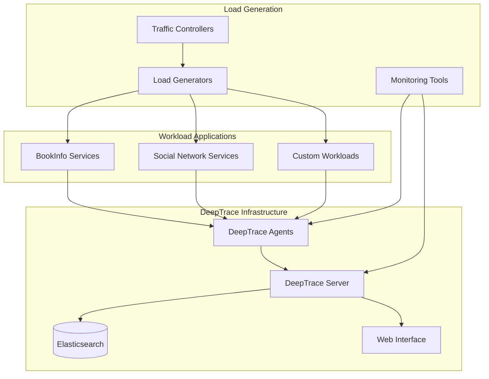
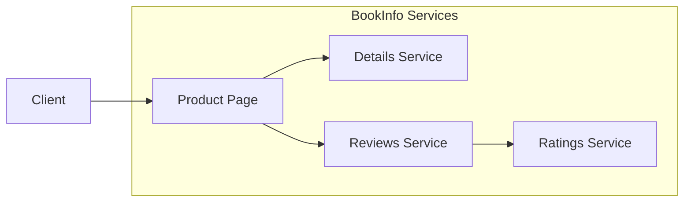
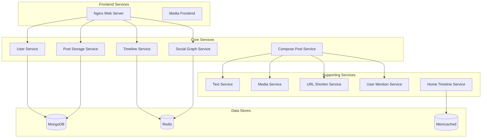

# Workload Applications

DeepTrace provides comprehensive support for testing and demonstrating distributed tracing capabilities across various application architectures. This document covers the available workload applications, their deployment procedures, and how to use them for testing and evaluation purposes.

## Overview

DeepTrace includes several pre-configured workload applications:

- **BookInfo**: A simple microservices application for basic testing
- **Social Network**: A complex microservices application for advanced scenarios
- **Custom Workloads**: Guidelines for integrating your own applications

These workloads serve multiple purposes:
- **Functional Testing**: Validating trace collection and correlation
- **Performance Evaluation**: Measuring system overhead and scalability
- **Demonstration**: Showcasing DeepTrace capabilities
- **Development**: Testing new features and improvements

## Architecture Overview



## BookInfo Microservices

### Application Overview

BookInfo is a simple microservices application that displays information about a book, similar to a single catalog entry of an online book store. It consists of four separate microservices:

- **Product Page**: The main frontend that displays book information
- **Details**: Contains book details (ISBN, pages, etc.)
- **Reviews**: Contains book reviews and calls the ratings service
- **Ratings**: Contains book ranking information

### Architecture



### Deployment

#### Prerequisites

```bash
# Ensure Docker and Docker Compose are installed
docker --version
docker-compose --version

# Verify system resources
free -h
df -h
```

#### Quick Deployment

```bash
# Navigate to BookInfo directory
cd tests/workload/bookinfo

# Deploy all services
sudo bash deploy.sh
```

The deployment script performs the following actions:

1. **Docker Installation**: Installs Docker and Docker Compose if not present
2. **Image Pulling**: Downloads required container images
3. **Network Setup**: Creates isolated network for services
4. **Service Startup**: Launches all microservices
5. **Health Checks**: Verifies service availability

#### Manual Deployment

```bash
# Pull required images
docker pull docker.1ms.run/istio/examples-bookinfo-productpage-v1:1.16.2
docker pull docker.1ms.run/istio/examples-bookinfo-details-v1:1.16.2
docker pull docker.1ms.run/istio/examples-bookinfo-reviews-v2:1.16.2
docker pull docker.1ms.run/istio/examples-bookinfo-ratings-v1:1.16.2

# Start services using Docker Compose
docker-compose up -d

# Verify deployment
docker-compose ps
```

#### Service Configuration

The `docker-compose.yaml` configuration:

```yaml
version: '3.8'
services:
  productpage:
    image: docker.1ms.run/istio/examples-bookinfo-productpage-v1:1.16.2
    ports:
      - "19080:9080"
    environment:
      - DETAILS_HOSTNAME=details
      - RATINGS_HOSTNAME=ratings
      - REVIEWS_HOSTNAME=reviews
    depends_on:
      - details
      - reviews
      - ratings

  details:
    image: docker.1ms.run/istio/examples-bookinfo-details-v1:1.16.2
    ports:
      - "9081:9080"

  reviews:
    image: docker.1ms.run/istio/examples-bookinfo-reviews-v2:1.16.2
    ports:
      - "9082:9080"
    environment:
      - RATINGS_HOSTNAME=ratings
    depends_on:
      - ratings

  ratings:
    image: docker.1ms.run/istio/examples-bookinfo-ratings-v1:1.16.2
    ports:
      - "9083:9080"

networks:
  bookinfo-net:
    driver: bridge
```

### Traffic Generation

#### Basic Traffic

```bash
# Start client container for traffic generation
sudo bash client.sh

# Inside the client container, generate requests
curl http://productpage:9080/productpage
```

#### Automated Load Testing

```bash
# Generate sustained load
for i in {1..1000}; do
    curl -s http://localhost:19080/productpage > /dev/null
    sleep 0.1
done
```

#### Advanced Load Patterns

```bash
# Burst traffic pattern
./generate_burst_traffic.sh --duration 300 --burst-size 50 --interval 10

# Gradual ramp-up
./generate_ramp_traffic.sh --start-rps 1 --end-rps 100 --duration 600

# Mixed workload
./generate_mixed_traffic.sh --read-ratio 0.8 --write-ratio 0.2 --duration 300
```

### Monitoring and Validation

#### Service Health Checks

```bash
# Check service status
curl -f http://localhost:19080/health
curl -f http://localhost:9081/health
curl -f http://localhost:9082/health
curl -f http://localhost:9083/health

# Verify service connectivity
docker exec bookinfo-client curl -f http://productpage:9080/productpage
```

#### Trace Validation

```bash
# Query Elasticsearch for traces
curl -X GET "localhost:9200/deeptrace-spans/_search" \
    -H 'Content-Type: application/json' \
    -d '{
        "query": {
            "bool": {
                "must": [
                    {"term": {"service_name": "productpage"}},
                    {"range": {"timestamp": {"gte": "now-1h"}}}
                ]
            }
        }
    }'
```

### Cleanup

```bash
# Stop and remove all services
sudo bash clear.sh

# Or manually with Docker Compose
docker-compose down -v
docker network prune -f
```

## Social Network Microservices

### Application Overview

The Social Network application is a complex microservices system that implements a Twitter-like social media platform. It demonstrates advanced distributed tracing scenarios with multiple service interactions, data persistence, and external integrations.

### Key Features

- **User Management**: Registration, authentication, and profile management
- **Content Creation**: Text posts with media attachments
- **Social Graph**: Follow/unfollow relationships and recommendations
- **Timeline Management**: User and home timeline generation
- **Search Functionality**: User and post search capabilities
- **Media Handling**: Image and video processing
- **URL Shortening**: External URL shortening service integration

### Service Architecture



### Deployment

#### Prerequisites

```bash
# System requirements check
free -h  # Minimum 8GB RAM recommended
df -h    # Minimum 10GB free space

# Install dependencies
sudo apt update
sudo apt install -y docker.io docker-compose python3 python3-pip
sudo apt install -y libssl-dev libz-dev luarocks
sudo luarocks install luasocket
```

#### Quick Deployment

```bash
# Navigate to Social Network directory
cd tests/workload/socialnetwork

# Deploy full stack
bash deploy.sh
```

The deployment script handles:

1. **Infrastructure Setup**: MongoDB, Redis, Memcached
2. **Service Deployment**: All microservices with proper dependencies
3. **Network Configuration**: Service discovery and load balancing
4. **Data Initialization**: Database schemas and seed data
5. **Health Verification**: Service readiness checks

#### Service-by-Service Deployment

```bash
# Start data stores first
docker-compose up -d mongodb redis-server memcached

# Start core services
docker-compose up -d user-service post-storage-service social-graph-service

# Start supporting services
docker-compose up -d text-service media-service url-shorten-service

# Start frontend services
docker-compose up -d nginx-web-server media-frontend

# Verify all services are running
docker-compose ps
```

#### Configuration Options

**Standard Deployment** (single machine):
```bash
docker-compose -f docker-compose.yml up -d
```

**Distributed Deployment** (Docker Swarm):
```bash
docker stack deploy --compose-file=docker-compose-swarm.yml socialnetwork
```

**TLS-Enabled Deployment**:
```bash
docker-compose -f docker-compose-tls.yml up -d
```

### Traffic Generation

#### Workload Characteristics

The Social Network application supports various traffic patterns:

- **User Registration**: New user sign-ups
- **Authentication**: User login/logout
- **Post Creation**: Text posts with media
- **Timeline Reads**: User and home timeline access
- **Social Actions**: Follow/unfollow operations
- **Search Queries**: User and content search

#### Load Generation Scripts

```bash
# Basic load generation
bash client.sh

# Comprehensive workload simulation
./social_network_bench.sh \
    --users 1000 \
    --posts-per-minute 500 \
    --reads-per-minute 5000 \
    --follows-per-minute 100 \
    --duration 600
```

#### Custom Load Patterns

```python
# Python load generator example
import asyncio
import aiohttp
import random

async def generate_social_load():
    async with aiohttp.ClientSession() as session:
        # User registration
        await register_users(session, count=100)
        
        # Post creation
        await create_posts(session, posts_per_user=10)
        
        # Timeline reads
        await read_timelines(session, reads_per_minute=1000)
        
        # Social interactions
        await follow_users(session, follows_per_user=20)

# Run load generation
asyncio.run(generate_social_load())
```

#### Monitoring Load Generation

```bash
# Monitor system resources during load
htop
iotop
nethogs

# Monitor application metrics
curl http://localhost:8080/metrics
curl http://localhost:8081/stats
```

### Performance Tuning

#### Database Optimization

**MongoDB Configuration**:
```javascript
// MongoDB performance tuning
db.adminCommand({
    setParameter: 1,
    internalQueryExecMaxBlockingSortBytes: 335544320
});

// Create indexes for better performance
db.posts.createIndex({"user_id": 1, "timestamp": -1});
db.users.createIndex({"username": 1});
db.social_graph.createIndex({"followee_id": 1});
```

**Redis Configuration**:
```bash
# Redis memory optimization
redis-cli CONFIG SET maxmemory 2gb
redis-cli CONFIG SET maxmemory-policy allkeys-lru

# Enable persistence
redis-cli CONFIG SET save "900 1 300 10 60 10000"
```

#### Service Scaling

```bash
# Scale specific services
docker-compose up -d --scale user-service=3
docker-compose up -d --scale post-storage-service=2
docker-compose up -d --scale timeline-service=3

# Monitor scaling effects
docker stats
```

### Trace Analysis

#### Expected Trace Patterns

**Post Creation Flow**:
1. Nginx receives POST request
2. Compose Post Service orchestrates creation
3. Text Service processes content
4. Media Service handles attachments
5. URL Shorten Service processes links
6. User Mention Service identifies mentions
7. Post Storage Service persists data
8. Timeline Service updates timelines

**Timeline Read Flow**:
1. Nginx receives GET request
2. Timeline Service processes request
3. Post Storage Service retrieves posts
4. User Service enriches with user data
5. Media Service provides media URLs
6. Response aggregation and return

#### Trace Validation Queries

```bash
# Query for complete post creation traces
curl -X GET "localhost:9200/deeptrace-spans/_search" \
    -H 'Content-Type: application/json' \
    -d '{
        "query": {
            "bool": {
                "must": [
                    {"term": {"operation_name": "compose_post"}},
                    {"range": {"duration": {"gte": 0}}}
                ]
            }
        },
        "sort": [{"timestamp": {"order": "desc"}}]
    }'

# Analyze service call patterns
curl -X GET "localhost:9200/deeptrace-spans/_search" \
    -H 'Content-Type: application/json' \
    -d '{
        "aggs": {
            "services": {
                "terms": {"field": "service_name"},
                "aggs": {
                    "avg_duration": {"avg": {"field": "duration"}}
                }
            }
        }
    }'
```

### Cleanup

```bash
# Complete cleanup
bash clear.sh

# Manual cleanup
docker-compose down -v
docker system prune -f
docker volume prune -f
```

## Custom Workloads

### Integration Guidelines

To integrate your own applications with DeepTrace:

#### Application Requirements

1. **Network Communication**: Applications must use network I/O
2. **Service Architecture**: Microservices or distributed components
3. **Protocol Support**: HTTP, gRPC, or TCP-based protocols
4. **Containerization**: Docker containers recommended

#### Integration Steps

1. **Deploy DeepTrace Agent**:
   ```bash
   # Install agent on application hosts
   ./install_agent.sh --config custom-agent.toml
   ```

2. **Configure Application**:
   ```yaml
   # docker-compose.yml
   version: '3.8'
   services:
     your-app:
       image: your-app:latest
       networks:
         - deeptrace-net
   
   networks:
     deeptrace-net:
       external: true
   ```

3. **Verify Trace Collection**:
   ```bash
   # Check for traces in Elasticsearch
   curl "localhost:9200/deeptrace-spans/_search?q=service_name:your-app"
   ```

#### Best Practices

- **Service Naming**: Use consistent, descriptive service names
- **Operation Naming**: Define clear operation names for endpoints
- **Error Handling**: Ensure proper error propagation
- **Resource Limits**: Set appropriate container resource limits
- **Health Checks**: Implement health check endpoints

### Testing Framework

#### Automated Testing

```bash
#!/bin/bash
# test_custom_workload.sh

WORKLOAD_NAME="$1"
DURATION="${2:-300}"

echo "Testing workload: $WORKLOAD_NAME"

# Deploy workload
./deploy_workload.sh "$WORKLOAD_NAME"

# Wait for services to be ready
./wait_for_services.sh "$WORKLOAD_NAME"

# Generate load
./generate_load.sh "$WORKLOAD_NAME" --duration "$DURATION"

# Validate traces
./validate_traces.sh "$WORKLOAD_NAME"

# Collect metrics
./collect_metrics.sh "$WORKLOAD_NAME"

# Cleanup
./cleanup_workload.sh "$WORKLOAD_NAME"

echo "Testing completed for $WORKLOAD_NAME"
```

#### Validation Scripts

```python
# validate_traces.py
import requests
import json
import sys

def validate_workload_traces(workload_name, elasticsearch_url):
    """Validate traces for a custom workload."""
    
    # Query for workload traces
    query = {
        "query": {
            "bool": {
                "must": [
                    {"wildcard": {"service_name": f"{workload_name}*"}},
                    {"range": {"timestamp": {"gte": "now-1h"}}}
                ]
            }
        },
        "aggs": {
            "services": {"terms": {"field": "service_name"}},
            "operations": {"terms": {"field": "operation_name"}}
        }
    }
    
    response = requests.get(
        f"{elasticsearch_url}/deeptrace-spans/_search",
        json=query
    )
    
    if response.status_code != 200:
        print(f"Error querying Elasticsearch: {response.status_code}")
        return False
    
    data = response.json()
    total_spans = data['hits']['total']['value']
    
    if total_spans == 0:
        print(f"No traces found for workload: {workload_name}")
        return False
    
    print(f"Found {total_spans} spans for workload: {workload_name}")
    
    # Validate service coverage
    services = [bucket['key'] for bucket in data['aggregations']['services']['buckets']]
    print(f"Services traced: {services}")
    
    # Validate operation coverage
    operations = [bucket['key'] for bucket in data['aggregations']['operations']['buckets']]
    print(f"Operations traced: {operations}")
    
    return True

if __name__ == "__main__":
    workload_name = sys.argv[1]
    elasticsearch_url = sys.argv[2] if len(sys.argv) > 2 else "http://localhost:9200"
    
    success = validate_workload_traces(workload_name, elasticsearch_url)
    sys.exit(0 if success else 1)
```

## Troubleshooting

### Common Issues

#### Service Startup Problems

```bash
# Check service logs
docker-compose logs service-name

# Verify network connectivity
docker exec container-name ping other-service

# Check resource usage
docker stats
```

#### Trace Collection Issues

```bash
# Verify agent is running
ps aux | grep deeptrace-agent

# Check agent logs
tail -f /var/log/deeptrace/agent.log

# Test Elasticsearch connectivity
curl http://localhost:9200/_cluster/health
```

#### Performance Problems

```bash
# Monitor system resources
htop
iotop
nethogs

# Check container resource limits
docker inspect container-name | grep -i memory
docker inspect container-name | grep -i cpu
```

### Debug Mode

Enable debug logging for detailed troubleshooting:

```bash
# Set debug environment variables
export RUST_LOG=debug
export DEEPTRACE_LOG_LEVEL=debug

# Restart services with debug logging
docker-compose down
docker-compose up -d
```

## Best Practices

### Deployment

- **Resource Planning**: Allocate sufficient CPU and memory
- **Network Isolation**: Use dedicated networks for workloads
- **Health Monitoring**: Implement comprehensive health checks
- **Graceful Shutdown**: Handle service termination properly

### Testing

- **Baseline Measurement**: Establish performance baselines
- **Gradual Load Increase**: Ramp up load gradually
- **Comprehensive Coverage**: Test all service interactions
- **Error Scenarios**: Include failure testing

### Monitoring

- **Multi-Level Monitoring**: System, application, and trace metrics
- **Alerting**: Set up alerts for critical issues
- **Dashboards**: Create comprehensive monitoring dashboards
- **Log Aggregation**: Centralize log collection and analysis
